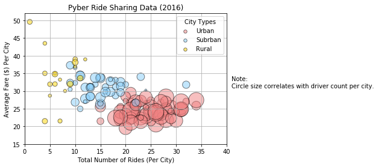
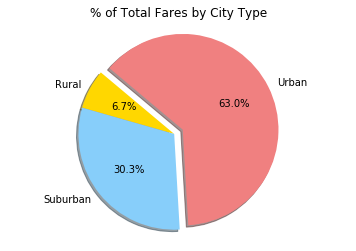
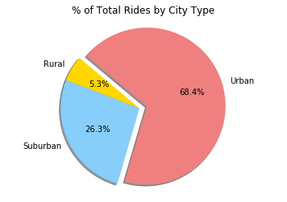
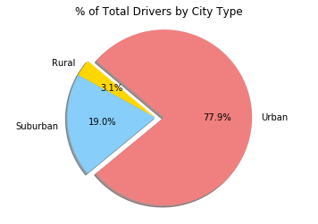

# Pyber Ride Sharing

<p>Based on the analysis of the given data sets, we can notice the following trends:</p>
<ul>
    <li>The major part of all drivers (approximately 78%) come from Urban cities.</li>
    <li>Rural cities have higher average fare, especially comparing to Urban cities.</li>
    <li>Urban city drivers make approximately 68% of all rides and bring 63% of total fare value.</li>


```python
import os
import pandas as pd
import matplotlib.pyplot as plt
import numpy as np
import seaborn
```


```python
#read city and ride data
city_file=os.path.join("raw_data","city_data.csv")
city_data=pd.read_csv(city_file)
#file "city_data.csv" contains two records for Port James:
#Port James with 3 drivers and Port James with 15 drivers. 
#Since pandas.DataFrame.merge doesn't check duplicate keys, I removed them using city_data.drop_duplicates
city_data1=city_data.drop_duplicates(subset='city', keep='first', inplace=False)

ride_file=os.path.join("raw_data","ride_data.csv")
ride_data=pd.read_csv(ride_file)
```


```python
#merge ride and city data into a single DataFrame
merge_table=pd.merge(ride_data, city_data1, on="city", how="left")

merge_table.head()
```


<div>
<style scoped>
    .dataframe tbody tr th:only-of-type {
        vertical-align: middle;
    }

    .dataframe tbody tr th {
        vertical-align: top;
    }

    .dataframe thead th {
        text-align: right;
    }
</style>
<table border="1" class="dataframe">
  <thead>
    <tr style="text-align: right;">
      <th></th>
      <th>city</th>
      <th>date</th>
      <th>fare</th>
      <th>ride_id</th>
      <th>driver_count</th>
      <th>type</th>
    </tr>
  </thead>
  <tbody>
    <tr>
      <th>0</th>
      <td>Sarabury</td>
      <td>2016-01-16 13:49:27</td>
      <td>38.35</td>
      <td>5403689035038</td>
      <td>46</td>
      <td>Urban</td>
    </tr>
    <tr>
      <th>1</th>
      <td>South Roy</td>
      <td>2016-01-02 18:42:34</td>
      <td>17.49</td>
      <td>4036272335942</td>
      <td>35</td>
      <td>Urban</td>
    </tr>
    <tr>
      <th>2</th>
      <td>Wiseborough</td>
      <td>2016-01-21 17:35:29</td>
      <td>44.18</td>
      <td>3645042422587</td>
      <td>55</td>
      <td>Urban</td>
    </tr>
    <tr>
      <th>3</th>
      <td>Spencertown</td>
      <td>2016-07-31 14:53:22</td>
      <td>6.87</td>
      <td>2242596575892</td>
      <td>68</td>
      <td>Urban</td>
    </tr>
    <tr>
      <th>4</th>
      <td>Nguyenbury</td>
      <td>2016-07-09 04:42:44</td>
      <td>6.28</td>
      <td>1543057793673</td>
      <td>8</td>
      <td>Urban</td>
    </tr>
  </tbody>
</table>
</div>


## Bubble Plot of Ride Sharing Data


```python
#prepare data for each city type(urban, suburban, rural):
#calculate average fare per city, total number of rides per city, total number of drivers per city


urban=merge_table.loc[merge_table["type"]=="Urban"]
urbangroup=urban.groupby("city")
urban_average_fare=urbangroup["fare"].mean()
urban_city_rides=urbangroup["ride_id"].count()
urban_city_drivers=urbangroup["driver_count"].max()

#----------------

suburban=merge_table.loc[merge_table["type"]=="Suburban"]
suburbangroup=suburban.groupby("city")
suburban_average_fare=suburbangroup["fare"].mean()
suburban_city_rides=suburbangroup["ride_id"].count()
suburban_city_drivers=suburbangroup["driver_count"].max()

#----------------

rural=merge_table.loc[merge_table["type"]=="Rural"]
ruralgroup=rural.groupby("city")
rural_average_fare=ruralgroup["fare"].mean()
rural_city_rides=ruralgroup["ride_id"].count()
rural_city_drivers=ruralgroup["driver_count"].max()

#build bubble plots for each city type

plt.scatter(urban_city_rides, urban_average_fare, color="lightcoral", edgecolor="black",
             label="Urban", alpha=0.5, s=10*urban_city_drivers, linewidths=1)
        
plt.scatter(suburban_city_rides, suburban_average_fare, color="lightskyblue", edgecolor="black",
             label="Subrban", alpha=0.5, s=10*suburban_city_drivers, linewidths=1)

plt.scatter(rural_city_rides, rural_average_fare, color="gold", edgecolor="black",
             label="Rural", alpha=0.5, s=10*rural_city_drivers, linewidths=1)
plt.grid()
plt.title("Pyber Ride Sharing Data (2016)")
plt.xlabel("Total Number of Rides (Per City)")
plt.ylabel("Average Fare ($) Per City")
plt.ylim(15,52)
plt.xlim(0,40)
plt.text(41,31,"Note:\nCircle size correlates with driver count per city.")
lgnd=plt.legend(loc="upper right", title="City Types", scatterpoints=1)

#solution for ._sizes comes from https://stackoverflow.com/questions/24706125/setting-a-fixed-size-for-points-in-legend
lgnd.legendHandles[0]._sizes = [30]
lgnd.legendHandles[1]._sizes = [30]
lgnd.legendHandles[2]._sizes = [30]
#----------------------------------
plt.savefig("pyber_analysis.png")
plt.show()
```





## Total Fares by City Type


```python
#calculate % of total fares by city type
fare=merge_table.groupby("type").sum()["fare"]
fare_sum=merge_table["fare"].sum()
percent_fare=fare/fare_sum

#create pie chart
labels=['Rural','Suburban','Urban']
colors=['Gold', 'lightskyblue','lightcoral']
explode=[0,0,0.1]
plt.pie(percent_fare,explode=explode,labels=labels,colors=colors, shadow=True, startangle=140, autopct='{:.1f}%'.format)
plt.axis("equal")
plt.title("% of Total Fares by City Type")
plt.savefig("pie_fares.png")
plt.show()
```





## Total Rides by City Type


```python
#calculate % of total rides by city type
ride=merge_table.groupby("type").count()["ride_id"]
ride_sum=merge_table["ride_id"].count()
percent_rides=ride/ride_sum

#create pie chart
labels=['Rural','Suburban','Urban']
colors=['Gold', 'lightskyblue','lightcoral']
explode=[0,0,0.1]
plt.pie(percent_rides,explode=explode,labels=labels,colors=colors, shadow=True, startangle=140, autopct='{:.1f}%'.format)
plt.axis("equal")
plt.title("% of Total Rides by City Type")
plt.savefig("pie_rides.png")
plt.show()
```





## Total Drivers by City Type


```python
#calculate % of total drivers by city type
city_type=city_data1.groupby("type")
total_drivers_type=city_type["driver_count"].sum()
total_drivers=city_data1["driver_count"].sum()
percent_drivers=total_drivers_type/total_drivers

#create pie chart
labels=['Rural','Suburban','Urban']
colors=['Gold', 'lightskyblue','lightcoral']
explode=[0,0,0.1]
plt.pie(percent_drivers,explode=explode,labels=labels,colors=colors, shadow=True, startangle=140, autopct='{:.1f}%'.format)
plt.axis("equal")
plt.title("% of Total Drivers by City Type")
plt.savefig("pie_drivers.png")
plt.show()

```




