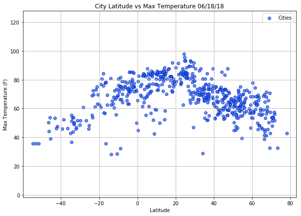
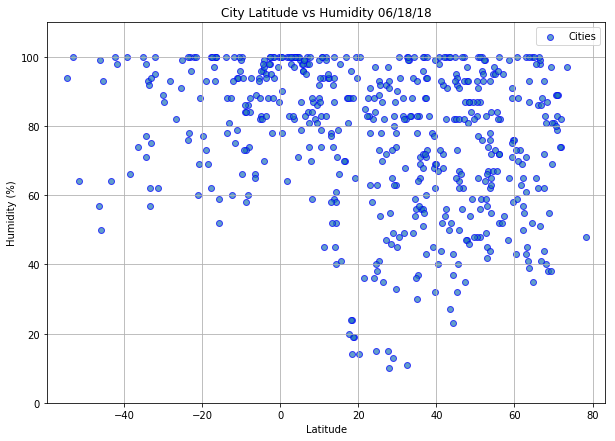
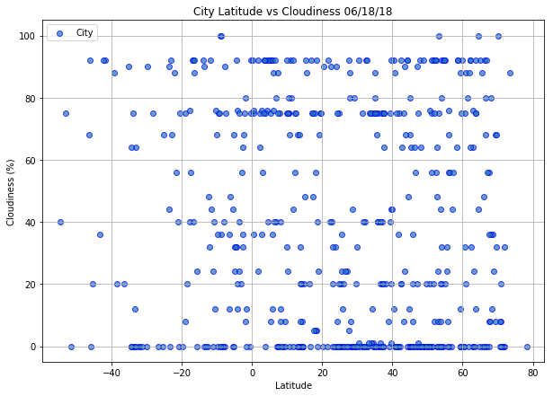
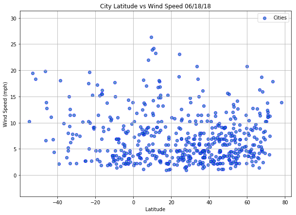

# WeatherPy

## Analysis

 <ul>
    <li>It is noticeable that cities with higher temperature (more than 80F) mostly belong to (0,40) latitude range of the Northern Hemisphere.</li>       
    <li>There is no strong correlation between latitude and humidity. However, the majority of cities with humidity less than 40% belong to the Northern Hemisphere.</li>
    <li>There is no noticeable correlation between latitude and wind speed. The wind speed for the majority of cities is less than 15 mph.</li>
</ul>


```python
import pandas as pd
import seaborn 
import json
import requests
import random
import time
from config import  wkey
from citipy import citipy
import matplotlib.pyplot as plt
```


```python
#Latitude values are measured relative to the equator and range from -90° at the South Pole to +90° at the North Pole.
#Longitude values are measured relative to the prime meridian. 
#They range from -180° when traveling west to 180° when traveling east.
lat=[]
lng=[]
#create lists of 1700  random float values for latitude and longitude
while len(lat)<=1700:
    lat.append(random.uniform(-90.00, 0.00)) 
    lat.append(random.uniform(0.00, 90.00))
while len(lng)<=1700:
    lng.append(random.uniform(-180.00, 0))
    lng.append(random.uniform(0.00, 180.00))

```


```python
#use citipy.nearest_city to find cities based on latitude and longitude
#as a result, cities is a list of the unique city names
cities=[]
for lt, ln in zip(lat, lng): 
    city=citipy.nearest_city(lt, ln)
    if city.city_name not in cities:
        cities.append(city.city_name)
print(f"We have {len(cities)} cities to retrieve from openweathermap.org")

```

    We have 609 cities to retrieve from openweathermap.org


```python
#API call:
url = "http://api.openweathermap.org/data/2.5/weather"
query_params = {
    'appid': wkey,
    'units': 'imperial'
}
not_found=0

#create an empty DataFrame to store  cities data
city_weather=pd.DataFrame(columns=["City","Cloudiness","Country","Date","Humidity","Lat","Lng","Max Temp","Wind Speed"])
index=0

#loop through each item in cities to perform API calls:

for i in range(len(cities)):
    #include print log of each city as it's being processed with the city number
    print(f'Retrieving Results for City {i}: {cities[i]}')
   
    try:
        query_params['q']=cities[i]
        response=requests.get(url, params=query_params)
        city_info=response.json()
        
        #print the city name and requested URL.
        print(f'URL: {response.url}')
        
        #add city data to city_info DataFrame
        city_weather.loc[index, 'City']=city_info["name"]
        city_weather.loc[index, 'Cloudiness']=city_info["clouds"]["all"]
        city_weather.loc[index, 'Country']=city_info["sys"]["country"]
        city_weather.loc[index, 'Date']=city_info["dt"]
        city_weather.loc[index, 'Humidity']=city_info["main"]["humidity"]
        city_weather.loc[index, 'Lat']=city_info["coord"]["lat"]
        city_weather.loc[index, 'Lng']=city_info["coord"]["lon"]
        city_weather.loc[index, 'Max Temp']=city_info["main"]["temp_max"]
        city_weather.loc[index, 'Wind Speed']=city_info["wind"]["speed"]
        
        index+=1
    #exception in case city data was not returned by API call
    except KeyError:
        print("Data is not found...Skipping...")
        not_found+=1
print("------------")
print('Data Retrieval Complete.')
print(f'Data for {not_found} cities is unavailable.')
print("------------")
city_weather.to_csv("output.csv")
print("Retrieved cities data is stored in output.csv")
```

    Retrieving Results for City 0: carauari
    URL: http://api.openweathermap.org/data/2.5/weather?appid=7fe071649c7a7cf58485c25164ba9e51&units=imperial&q=carauari
    Retrieving Results for City 1: impfondo
    URL: http://api.openweathermap.org/data/2.5/weather?appid=7fe071649c7a7cf58485c25164ba9e51&units=imperial&q=impfondo
    Retrieving Results for City 2: ushuaia
    URL: http://api.openweathermap.org/data/2.5/weather?appid=7fe071649c7a7cf58485c25164ba9e51&units=imperial&q=ushuaia
    Retrieving Results for City 3: balaguer
    URL: http://api.openweathermap.org/data/2.5/weather?appid=7fe071649c7a7cf58485c25164ba9e51&units=imperial&q=balaguer
    Retrieving Results for City 4: punta arenas
    URL: http://api.openweathermap.org/data/2.5/weather?appid=7fe071649c7a7cf58485c25164ba9e51&units=imperial&q=punta+arenas
    Retrieving Results for City 5: ostrovnoy
    URL: http://api.openweathermap.org/data/2.5/weather?appid=7fe071649c7a7cf58485c25164ba9e51&units=imperial&q=ostrovnoy
    Retrieving Results for City 6: rikitea
    URL: http://api.openweathermap.org/data/2.5/weather?appid=7fe071649c7a7cf58485c25164ba9e51&units=imperial&q=rikitea
    Retrieving Results for City 7: ginir
    URL: http://api.openweathermap.org/data/2.5/weather?appid=7fe071649c7a7cf58485c25164ba9e51&units=imperial&q=ginir
    Retrieving Results for City 8: cidreira
    URL: http://api.openweathermap.org/data/2.5/weather?appid=7fe071649c7a7cf58485c25164ba9e51&units=imperial&q=cidreira
    Retrieving Results for City 9: tessalit
    URL: http://api.openweathermap.org/data/2.5/weather?appid=7fe071649c7a7cf58485c25164ba9e51&units=imperial&q=tessalit
    Retrieving Results for City 10: mataura
    URL: http://api.openweathermap.org/data/2.5/weather?appid=7fe071649c7a7cf58485c25164ba9e51&units=imperial&q=mataura
    Retrieving Results for City 11: nikolskoye
    URL: http://api.openweathermap.org/data/2.5/weather?appid=7fe071649c7a7cf58485c25164ba9e51&units=imperial&q=nikolskoye
    Retrieving Results for City 12: kosonsoy
    URL: http://api.openweathermap.org/data/2.5/weather?appid=7fe071649c7a7cf58485c25164ba9e51&units=imperial&q=kosonsoy
    Retrieving Results for City 13: coelho neto
    URL: http://api.openweathermap.org/data/2.5/weather?appid=7fe071649c7a7cf58485c25164ba9e51&units=imperial&q=coelho+neto
    Retrieving Results for City 14: chiang klang
    URL: http://api.openweathermap.org/data/2.5/weather?appid=7fe071649c7a7cf58485c25164ba9e51&units=imperial&q=chiang+klang
    Retrieving Results for City 15: vaini
    URL: http://api.openweathermap.org/data/2.5/weather?appid=7fe071649c7a7cf58485c25164ba9e51&units=imperial&q=vaini
    Retrieving Results for City 16: salalah
    URL: http://api.openweathermap.org/data/2.5/weather?appid=7fe071649c7a7cf58485c25164ba9e51&units=imperial&q=salalah
    Retrieving Results for City 17: ancud
    URL: http://api.openweathermap.org/data/2.5/weather?appid=7fe071649c7a7cf58485c25164ba9e51&units=imperial&q=ancud
    Retrieving Results for City 18: amderma
    URL: http://api.openweathermap.org/data/2.5/weather?appid=7fe071649c7a7cf58485c25164ba9e51&units=imperial&q=amderma
    Data is not found...Skipping...
    Retrieving Results for City 19: dukat
    URL: http://api.openweathermap.org/data/2.5/weather?appid=7fe071649c7a7cf58485c25164ba9e51&units=imperial&q=dukat
    Retrieving Results for City 20: belaya gora
    URL: http://api.openweathermap.org/data/2.5/weather?appid=7fe071649c7a7cf58485c25164ba9e51&units=imperial&q=belaya+gora
    Retrieving Results for City 21: cape town
    URL: http://api.openweathermap.org/data/2.5/weather?appid=7fe071649c7a7cf58485c25164ba9e51&units=imperial&q=cape+town
    Retrieving Results for City 22: aginskoye
    URL: http://api.openweathermap.org/data/2.5/weather?appid=7fe071649c7a7cf58485c25164ba9e51&units=imperial&q=aginskoye
    Retrieving Results for City 23: leningradskiy
    URL: http://api.openweathermap.org/data/2.5/weather?appid=7fe071649c7a7cf58485c25164ba9e51&units=imperial&q=leningradskiy
    Retrieving Results for City 24: avarua
    URL: http://api.openweathermap.org/data/2.5/weather?appid=7fe071649c7a7cf58485c25164ba9e51&units=imperial&q=avarua
    Retrieving Results for City 25: dwarka
    URL: http://api.openweathermap.org/data/2.5/weather?appid=7fe071649c7a7cf58485c25164ba9e51&units=imperial&q=dwarka
    Retrieving Results for City 26: saldanha
    URL: http://api.openweathermap.org/data/2.5/weather?appid=7fe071649c7a7cf58485c25164ba9e51&units=imperial&q=saldanha
    Retrieving Results for City 27: dhankuta
    URL: http://api.openweathermap.org/data/2.5/weather?appid=7fe071649c7a7cf58485c25164ba9e51&units=imperial&q=dhankuta
    Retrieving Results for City 28: saveh
    URL: http://api.openweathermap.org/data/2.5/weather?appid=7fe071649c7a7cf58485c25164ba9e51&units=imperial&q=saveh
    Retrieving Results for City 29: korla
    URL: http://api.openweathermap.org/data/2.5/weather?appid=7fe071649c7a7cf58485c25164ba9e51&units=imperial&q=korla
    Data is not found...Skipping...
    Retrieving Results for City 30: castro
    URL: http://api.openweathermap.org/data/2.5/weather?appid=7fe071649c7a7cf58485c25164ba9e51&units=imperial&q=castro
    Retrieving Results for City 31: mawlaik
    URL: http://api.openweathermap.org/data/2.5/weather?appid=7fe071649c7a7cf58485c25164ba9e51&units=imperial&q=mawlaik
    Retrieving Results for City 32: berlevag
    URL: http://api.openweathermap.org/data/2.5/weather?appid=7fe071649c7a7cf58485c25164ba9e51&units=imperial&q=berlevag
    Retrieving Results for City 33: macaboboni
    URL: http://api.openweathermap.org/data/2.5/weather?appid=7fe071649c7a7cf58485c25164ba9e51&units=imperial&q=macaboboni
    Data is not found...Skipping...
    Retrieving Results for City 34: talara
    URL: http://api.openweathermap.org/data/2.5/weather?appid=7fe071649c7a7cf58485c25164ba9e51&units=imperial&q=talara
    Retrieving Results for City 35: kushima
    URL: http://api.openweathermap.org/data/2.5/weather?appid=7fe071649c7a7cf58485c25164ba9e51&units=imperial&q=kushima
    Retrieving Results for City 36: karaul
    URL: http://api.openweathermap.org/data/2.5/weather?appid=7fe071649c7a7cf58485c25164ba9e51&units=imperial&q=karaul
    Data is not found...Skipping...
    Retrieving Results for City 37: jamestown
    URL: http://api.openweathermap.org/data/2.5/weather?appid=7fe071649c7a7cf58485c25164ba9e51&units=imperial&q=jamestown
    Retrieving Results for City 38: yumen
    URL: http://api.openweathermap.org/data/2.5/weather?appid=7fe071649c7a7cf58485c25164ba9e51&units=imperial&q=yumen
    Retrieving Results for City 39: bati
    URL: http://api.openweathermap.org/data/2.5/weather?appid=7fe071649c7a7cf58485c25164ba9e51&units=imperial&q=bati
    Retrieving Results for City 40: puerto quijarro
    URL: http://api.openweathermap.org/data/2.5/weather?appid=7fe071649c7a7cf58485c25164ba9e51&units=imperial&q=puerto+quijarro
    Retrieving Results for City 41: mata
    URL: http://api.openweathermap.org/data/2.5/weather?appid=7fe071649c7a7cf58485c25164ba9e51&units=imperial&q=mata
    Retrieving Results for City 42: fare
    URL: http://api.openweathermap.org/data/2.5/weather?appid=7fe071649c7a7cf58485c25164ba9e51&units=imperial&q=fare
    Retrieving Results for City 43: kalmunai
    URL: http://api.openweathermap.org/data/2.5/weather?appid=7fe071649c7a7cf58485c25164ba9e51&units=imperial&q=kalmunai
    Retrieving Results for City 44: mar del plata
    URL: http://api.openweathermap.org/data/2.5/weather?appid=7fe071649c7a7cf58485c25164ba9e51&units=imperial&q=mar+del+plata
    Retrieving Results for City 45: honningsvag
    URL: http://api.openweathermap.org/data/2.5/weather?appid=7fe071649c7a7cf58485c25164ba9e51&units=imperial&q=honningsvag
    Retrieving Results for City 46: georgetown
    URL: http://api.openweathermap.org/data/2.5/weather?appid=7fe071649c7a7cf58485c25164ba9e51&units=imperial&q=georgetown
    Retrieving Results for City 47: siwana
    URL: http://api.openweathermap.org/data/2.5/weather?appid=7fe071649c7a7cf58485c25164ba9e51&units=imperial&q=siwana
    Retrieving Results for City 48: umarkot
    URL: http://api.openweathermap.org/data/2.5/weather?appid=7fe071649c7a7cf58485c25164ba9e51&units=imperial&q=umarkot
    Retrieving Results for City 49: faya
    URL: http://api.openweathermap.org/data/2.5/weather?appid=7fe071649c7a7cf58485c25164ba9e51&units=imperial&q=faya
    Retrieving Results for City 50: male
    URL: http://api.openweathermap.org/data/2.5/weather?appid=7fe071649c7a7cf58485c25164ba9e51&units=imperial&q=male
    Retrieving Results for City 51: adrar
    URL: http://api.openweathermap.org/data/2.5/weather?appid=7fe071649c7a7cf58485c25164ba9e51&units=imperial&q=adrar
    Retrieving Results for City 52: meulaboh
    URL: http://api.openweathermap.org/data/2.5/weather?appid=7fe071649c7a7cf58485c25164ba9e51&units=imperial&q=meulaboh
    Retrieving Results for City 53: pisco
    URL: http://api.openweathermap.org/data/2.5/weather?appid=7fe071649c7a7cf58485c25164ba9e51&units=imperial&q=pisco
    Retrieving Results for City 54: doha
    URL: http://api.openweathermap.org/data/2.5/weather?appid=7fe071649c7a7cf58485c25164ba9e51&units=imperial&q=doha
    Retrieving Results for City 55: jiuquan
    URL: http://api.openweathermap.org/data/2.5/weather?appid=7fe071649c7a7cf58485c25164ba9e51&units=imperial&q=jiuquan
    Retrieving Results for City 56: gannan
    URL: http://api.openweathermap.org/data/2.5/weather?appid=7fe071649c7a7cf58485c25164ba9e51&units=imperial&q=gannan
    Retrieving Results for City 57: tir pol
    URL: http://api.openweathermap.org/data/2.5/weather?appid=7fe071649c7a7cf58485c25164ba9e51&units=imperial&q=tir+pol
    Data is not found...Skipping...
    Retrieving Results for City 58: cherskiy
    URL: http://api.openweathermap.org/data/2.5/weather?appid=7fe071649c7a7cf58485c25164ba9e51&units=imperial&q=cherskiy
    Retrieving Results for City 59: uthal
    URL: http://api.openweathermap.org/data/2.5/weather?appid=7fe071649c7a7cf58485c25164ba9e51&units=imperial&q=uthal
    Retrieving Results for City 60: atuona
    URL: http://api.openweathermap.org/data/2.5/weather?appid=7fe071649c7a7cf58485c25164ba9e51&units=imperial&q=atuona
    Retrieving Results for City 61: moldova noua
    URL: http://api.openweathermap.org/data/2.5/weather?appid=7fe071649c7a7cf58485c25164ba9e51&units=imperial&q=moldova+noua
    Retrieving Results for City 62: barentsburg
    URL: http://api.openweathermap.org/data/2.5/weather?appid=7fe071649c7a7cf58485c25164ba9e51&units=imperial&q=barentsburg
    Data is not found...Skipping...
    Retrieving Results for City 63: katsina
    URL: http://api.openweathermap.org/data/2.5/weather?appid=7fe071649c7a7cf58485c25164ba9e51&units=imperial&q=katsina
    Retrieving Results for City 64: butaritari
    URL: http://api.openweathermap.org/data/2.5/weather?appid=7fe071649c7a7cf58485c25164ba9e51&units=imperial&q=butaritari
    Retrieving Results for City 65: puerto ayora
    URL: http://api.openweathermap.org/data/2.5/weather?appid=7fe071649c7a7cf58485c25164ba9e51&units=imperial&q=puerto+ayora
    Retrieving Results for City 66: jumla
    URL: http://api.openweathermap.org/data/2.5/weather?appid=7fe071649c7a7cf58485c25164ba9e51&units=imperial&q=jumla
    Retrieving Results for City 67: naze
    URL: http://api.openweathermap.org/data/2.5/weather?appid=7fe071649c7a7cf58485c25164ba9e51&units=imperial&q=naze
    Retrieving Results for City 68: santa barbara
    URL: http://api.openweathermap.org/data/2.5/weather?appid=7fe071649c7a7cf58485c25164ba9e51&units=imperial&q=santa+barbara
    Retrieving Results for City 69: danjiangkou
    URL: http://api.openweathermap.org/data/2.5/weather?appid=7fe071649c7a7cf58485c25164ba9e51&units=imperial&q=danjiangkou
    Retrieving Results for City 70: khatanga
    URL: http://api.openweathermap.org/data/2.5/weather?appid=7fe071649c7a7cf58485c25164ba9e51&units=imperial&q=khatanga
    Retrieving Results for City 71: airai
    URL: http://api.openweathermap.org/data/2.5/weather?appid=7fe071649c7a7cf58485c25164ba9e51&units=imperial&q=airai
    Retrieving Results for City 72: vaitupu
    URL: http://api.openweathermap.org/data/2.5/weather?appid=7fe071649c7a7cf58485c25164ba9e51&units=imperial&q=vaitupu
    Data is not found...Skipping...
    Retrieving Results for City 73: arlit
    URL: http://api.openweathermap.org/data/2.5/weather?appid=7fe071649c7a7cf58485c25164ba9e51&units=imperial&q=arlit
    Retrieving Results for City 74: kaduqli
    URL: http://api.openweathermap.org/data/2.5/weather?appid=7fe071649c7a7cf58485c25164ba9e51&units=imperial&q=kaduqli
    Retrieving Results for City 75: severo-kurilsk
    URL: http://api.openweathermap.org/data/2.5/weather?appid=7fe071649c7a7cf58485c25164ba9e51&units=imperial&q=severo-kurilsk
    Retrieving Results for City 76: arraial do cabo
    URL: http://api.openweathermap.org/data/2.5/weather?appid=7fe071649c7a7cf58485c25164ba9e51&units=imperial&q=arraial+do+cabo
    Retrieving Results for City 77: nong khai
    URL: http://api.openweathermap.org/data/2.5/weather?appid=7fe071649c7a7cf58485c25164ba9e51&units=imperial&q=nong+khai
    Retrieving Results for City 78: senador pompeu
    URL: http://api.openweathermap.org/data/2.5/weather?appid=7fe071649c7a7cf58485c25164ba9e51&units=imperial&q=senador+pompeu
    Retrieving Results for City 79: oksfjord
    URL: http://api.openweathermap.org/data/2.5/weather?appid=7fe071649c7a7cf58485c25164ba9e51&units=imperial&q=oksfjord
    Retrieving Results for City 80: alofi
    URL: http://api.openweathermap.org/data/2.5/weather?appid=7fe071649c7a7cf58485c25164ba9e51&units=imperial&q=alofi
    Retrieving Results for City 81: svetlogorsk
    URL: http://api.openweathermap.org/data/2.5/weather?appid=7fe071649c7a7cf58485c25164ba9e51&units=imperial&q=svetlogorsk
    Retrieving Results for City 82: constitucion
    URL: http://api.openweathermap.org/data/2.5/weather?appid=7fe071649c7a7cf58485c25164ba9e51&units=imperial&q=constitucion
    Retrieving Results for City 83: kotdwara
    URL: http://api.openweathermap.org/data/2.5/weather?appid=7fe071649c7a7cf58485c25164ba9e51&units=imperial&q=kotdwara
    Retrieving Results for City 84: lebu
    URL: http://api.openweathermap.org/data/2.5/weather?appid=7fe071649c7a7cf58485c25164ba9e51&units=imperial&q=lebu
    Retrieving Results for City 85: manzil salim
    URL: http://api.openweathermap.org/data/2.5/weather?appid=7fe071649c7a7cf58485c25164ba9e51&units=imperial&q=manzil+salim
    Retrieving Results for City 86: gravdal
    URL: http://api.openweathermap.org/data/2.5/weather?appid=7fe071649c7a7cf58485c25164ba9e51&units=imperial&q=gravdal
    Retrieving Results for City 87: paraibano
    URL: http://api.openweathermap.org/data/2.5/weather?appid=7fe071649c7a7cf58485c25164ba9e51&units=imperial&q=paraibano
    Retrieving Results for City 88: longyearbyen
    URL: http://api.openweathermap.org/data/2.5/weather?appid=7fe071649c7a7cf58485c25164ba9e51&units=imperial&q=longyearbyen
    Retrieving Results for City 89: lesogorsk
    URL: http://api.openweathermap.org/data/2.5/weather?appid=7fe071649c7a7cf58485c25164ba9e51&units=imperial&q=lesogorsk
    Retrieving Results for City 90: krasnoselkup
    URL: http://api.openweathermap.org/data/2.5/weather?appid=7fe071649c7a7cf58485c25164ba9e51&units=imperial&q=krasnoselkup
    Data is not found...Skipping...
    Retrieving Results for City 91: baoding
    URL: http://api.openweathermap.org/data/2.5/weather?appid=7fe071649c7a7cf58485c25164ba9e51&units=imperial&q=baoding
    Retrieving Results for City 92: lanzhou
    URL: http://api.openweathermap.org/data/2.5/weather?appid=7fe071649c7a7cf58485c25164ba9e51&units=imperial&q=lanzhou
    Retrieving Results for City 93: maragogi
    URL: http://api.openweathermap.org/data/2.5/weather?appid=7fe071649c7a7cf58485c25164ba9e51&units=imperial&q=maragogi
    Retrieving Results for City 94: karakose
    URL: http://api.openweathermap.org/data/2.5/weather?appid=7fe071649c7a7cf58485c25164ba9e51&units=imperial&q=karakose
    Data is not found...Skipping...
    Retrieving Results for City 95: labytnangi
    URL: http://api.openweathermap.org/data/2.5/weather?appid=7fe071649c7a7cf58485c25164ba9e51&units=imperial&q=labytnangi
    Retrieving Results for City 96: faanui
    URL: http://api.openweathermap.org/data/2.5/weather?appid=7fe071649c7a7cf58485c25164ba9e51&units=imperial&q=faanui
    Retrieving Results for City 97: chokurdakh
    URL: http://api.openweathermap.org/data/2.5/weather?appid=7fe071649c7a7cf58485c25164ba9e51&units=imperial&q=chokurdakh
    Retrieving Results for City 98: hualmay
    URL: http://api.openweathermap.org/data/2.5/weather?appid=7fe071649c7a7cf58485c25164ba9e51&units=imperial&q=hualmay
    Retrieving Results for City 99: jijiga
    URL: http://api.openweathermap.org/data/2.5/weather?appid=7fe071649c7a7cf58485c25164ba9e51&units=imperial&q=jijiga
    Retrieving Results for City 100: petropavlovsk-kamchatskiy
    URL: http://api.openweathermap.org/data/2.5/weather?appid=7fe071649c7a7cf58485c25164ba9e51&units=imperial&q=petropavlovsk-kamchatskiy
    Retrieving Results for City 101: kazerun
    URL: http://api.openweathermap.org/data/2.5/weather?appid=7fe071649c7a7cf58485c25164ba9e51&units=imperial&q=kazerun
    Retrieving Results for City 102: dikson
    URL: http://api.openweathermap.org/data/2.5/weather?appid=7fe071649c7a7cf58485c25164ba9e51&units=imperial&q=dikson
    Retrieving Results for City 103: kirs
    URL: http://api.openweathermap.org/data/2.5/weather?appid=7fe071649c7a7cf58485c25164ba9e51&units=imperial&q=kirs
    Retrieving Results for City 104: saskylakh
    URL: http://api.openweathermap.org/data/2.5/weather?appid=7fe071649c7a7cf58485c25164ba9e51&units=imperial&q=saskylakh
    Retrieving Results for City 105: chicama
    URL: http://api.openweathermap.org/data/2.5/weather?appid=7fe071649c7a7cf58485c25164ba9e51&units=imperial&q=chicama
    Retrieving Results for City 106: hasaki
    URL: http://api.openweathermap.org/data/2.5/weather?appid=7fe071649c7a7cf58485c25164ba9e51&units=imperial&q=hasaki
    Retrieving Results for City 107: belushya guba
    URL: http://api.openweathermap.org/data/2.5/weather?appid=7fe071649c7a7cf58485c25164ba9e51&units=imperial&q=belushya+guba
    Data is not found...Skipping...
    Retrieving Results for City 108: wokha
    URL: http://api.openweathermap.org/data/2.5/weather?appid=7fe071649c7a7cf58485c25164ba9e51&units=imperial&q=wokha
    Retrieving Results for City 109: okhotsk
    URL: http://api.openweathermap.org/data/2.5/weather?appid=7fe071649c7a7cf58485c25164ba9e51&units=imperial&q=okhotsk
    Retrieving Results for City 110: bosanska dubica
    URL: http://api.openweathermap.org/data/2.5/weather?appid=7fe071649c7a7cf58485c25164ba9e51&units=imperial&q=bosanska+dubica
    Retrieving Results for City 111: kuryk
    URL: http://api.openweathermap.org/data/2.5/weather?appid=7fe071649c7a7cf58485c25164ba9e51&units=imperial&q=kuryk
    Retrieving Results for City 112: lorengau
    URL: http://api.openweathermap.org/data/2.5/weather?appid=7fe071649c7a7cf58485c25164ba9e51&units=imperial&q=lorengau
    Retrieving Results for City 113: nizhneyansk
    URL: http://api.openweathermap.org/data/2.5/weather?appid=7fe071649c7a7cf58485c25164ba9e51&units=imperial&q=nizhneyansk
    Data is not found...Skipping...
    Retrieving Results for City 114: ormara
    URL: http://api.openweathermap.org/data/2.5/weather?appid=7fe071649c7a7cf58485c25164ba9e51&units=imperial&q=ormara
    Retrieving Results for City 115: aswan
    URL: http://api.openweathermap.org/data/2.5/weather?appid=7fe071649c7a7cf58485c25164ba9e51&units=imperial&q=aswan
    Retrieving Results for City 116: humberto de campos
    URL: http://api.openweathermap.org/data/2.5/weather?appid=7fe071649c7a7cf58485c25164ba9e51&units=imperial&q=humberto+de+campos
    Retrieving Results for City 117: karakol
    URL: http://api.openweathermap.org/data/2.5/weather?appid=7fe071649c7a7cf58485c25164ba9e51&units=imperial&q=karakol
    Retrieving Results for City 118: buluang
    URL: http://api.openweathermap.org/data/2.5/weather?appid=7fe071649c7a7cf58485c25164ba9e51&units=imperial&q=buluang
    Retrieving Results for City 119: chuy
    URL: http://api.openweathermap.org/data/2.5/weather?appid=7fe071649c7a7cf58485c25164ba9e51&units=imperial&q=chuy
    Retrieving Results for City 120: vanavara
    URL: http://api.openweathermap.org/data/2.5/weather?appid=7fe071649c7a7cf58485c25164ba9e51&units=imperial&q=vanavara
    Retrieving Results for City 121: fort-shevchenko
    URL: http://api.openweathermap.org/data/2.5/weather?appid=7fe071649c7a7cf58485c25164ba9e51&units=imperial&q=fort-shevchenko
    Retrieving Results for City 122: vrangel
    URL: http://api.openweathermap.org/data/2.5/weather?appid=7fe071649c7a7cf58485c25164ba9e51&units=imperial&q=vrangel
    Retrieving Results for City 123: san martino di lupari
    URL: http://api.openweathermap.org/data/2.5/weather?appid=7fe071649c7a7cf58485c25164ba9e51&units=imperial&q=san+martino+di+lupari
    Retrieving Results for City 124: arroio grande
    URL: http://api.openweathermap.org/data/2.5/weather?appid=7fe071649c7a7cf58485c25164ba9e51&units=imperial&q=arroio+grande
    Retrieving Results for City 125: makinsk
    URL: http://api.openweathermap.org/data/2.5/weather?appid=7fe071649c7a7cf58485c25164ba9e51&units=imperial&q=makinsk
    Retrieving Results for City 126: mahibadhoo
    URL: http://api.openweathermap.org/data/2.5/weather?appid=7fe071649c7a7cf58485c25164ba9e51&units=imperial&q=mahibadhoo
    Retrieving Results for City 127: aksarka
    URL: http://api.openweathermap.org/data/2.5/weather?appid=7fe071649c7a7cf58485c25164ba9e51&units=imperial&q=aksarka
    Retrieving Results for City 128: ranong
    URL: http://api.openweathermap.org/data/2.5/weather?appid=7fe071649c7a7cf58485c25164ba9e51&units=imperial&q=ranong
    Retrieving Results for City 129: caravelas
    URL: http://api.openweathermap.org/data/2.5/weather?appid=7fe071649c7a7cf58485c25164ba9e51&units=imperial&q=caravelas
    Retrieving Results for City 130: saleaula
    URL: http://api.openweathermap.org/data/2.5/weather?appid=7fe071649c7a7cf58485c25164ba9e51&units=imperial&q=saleaula
    Data is not found...Skipping...
    Retrieving Results for City 131: sapapalii
    URL: http://api.openweathermap.org/data/2.5/weather?appid=7fe071649c7a7cf58485c25164ba9e51&units=imperial&q=sapapalii
    Data is not found...Skipping...
    Retrieving Results for City 132: tiksi
    URL: http://api.openweathermap.org/data/2.5/weather?appid=7fe071649c7a7cf58485c25164ba9e51&units=imperial&q=tiksi
    Retrieving Results for City 133: ouallam
    URL: http://api.openweathermap.org/data/2.5/weather?appid=7fe071649c7a7cf58485c25164ba9e51&units=imperial&q=ouallam
    Retrieving Results for City 134: aracaju
    URL: http://api.openweathermap.org/data/2.5/weather?appid=7fe071649c7a7cf58485c25164ba9e51&units=imperial&q=aracaju
    Retrieving Results for City 135: kavaratti
    URL: http://api.openweathermap.org/data/2.5/weather?appid=7fe071649c7a7cf58485c25164ba9e51&units=imperial&q=kavaratti
    Retrieving Results for City 136: temerloh
    URL: http://api.openweathermap.org/data/2.5/weather?appid=7fe071649c7a7cf58485c25164ba9e51&units=imperial&q=temerloh
    Retrieving Results for City 137: kamaishi
    URL: http://api.openweathermap.org/data/2.5/weather?appid=7fe071649c7a7cf58485c25164ba9e51&units=imperial&q=kamaishi
    Retrieving Results for City 138: balkanabat
    URL: http://api.openweathermap.org/data/2.5/weather?appid=7fe071649c7a7cf58485c25164ba9e51&units=imperial&q=balkanabat
    Retrieving Results for City 139: deputatskiy
    URL: http://api.openweathermap.org/data/2.5/weather?appid=7fe071649c7a7cf58485c25164ba9e51&units=imperial&q=deputatskiy
    Retrieving Results for City 140: kanlagay
    URL: http://api.openweathermap.org/data/2.5/weather?appid=7fe071649c7a7cf58485c25164ba9e51&units=imperial&q=kanlagay
    Retrieving Results for City 141: kut chap
    URL: http://api.openweathermap.org/data/2.5/weather?appid=7fe071649c7a7cf58485c25164ba9e51&units=imperial&q=kut+chap
    Retrieving Results for City 142: tukrah
    URL: http://api.openweathermap.org/data/2.5/weather?appid=7fe071649c7a7cf58485c25164ba9e51&units=imperial&q=tukrah
    Data is not found...Skipping...
    Retrieving Results for City 143: udachnyy
    URL: http://api.openweathermap.org/data/2.5/weather?appid=7fe071649c7a7cf58485c25164ba9e51&units=imperial&q=udachnyy
    Retrieving Results for City 144: rebrikha
    URL: http://api.openweathermap.org/data/2.5/weather?appid=7fe071649c7a7cf58485c25164ba9e51&units=imperial&q=rebrikha
    Retrieving Results for City 145: chifeng
    URL: http://api.openweathermap.org/data/2.5/weather?appid=7fe071649c7a7cf58485c25164ba9e51&units=imperial&q=chifeng
    Retrieving Results for City 146: eskasem
    URL: http://api.openweathermap.org/data/2.5/weather?appid=7fe071649c7a7cf58485c25164ba9e51&units=imperial&q=eskasem
    Data is not found...Skipping...
    Retrieving Results for City 147: sao joao do piaui
    URL: http://api.openweathermap.org/data/2.5/weather?appid=7fe071649c7a7cf58485c25164ba9e51&units=imperial&q=sao+joao+do+piaui
    Retrieving Results for City 148: tazovskiy
    URL: http://api.openweathermap.org/data/2.5/weather?appid=7fe071649c7a7cf58485c25164ba9e51&units=imperial&q=tazovskiy
    Retrieving Results for City 149: santa rosa
    URL: http://api.openweathermap.org/data/2.5/weather?appid=7fe071649c7a7cf58485c25164ba9e51&units=imperial&q=santa+rosa
    Retrieving Results for City 150: zinder
    URL: http://api.openweathermap.org/data/2.5/weather?appid=7fe071649c7a7cf58485c25164ba9e51&units=imperial&q=zinder
    Retrieving Results for City 151: neiafu
    URL: http://api.openweathermap.org/data/2.5/weather?appid=7fe071649c7a7cf58485c25164ba9e51&units=imperial&q=neiafu
    Retrieving Results for City 152: ust-nera
    URL: http://api.openweathermap.org/data/2.5/weather?appid=7fe071649c7a7cf58485c25164ba9e51&units=imperial&q=ust-nera
    Retrieving Results for City 153: atasu
    URL: http://api.openweathermap.org/data/2.5/weather?appid=7fe071649c7a7cf58485c25164ba9e51&units=imperial&q=atasu
    Retrieving Results for City 154: hermanus
    URL: http://api.openweathermap.org/data/2.5/weather?appid=7fe071649c7a7cf58485c25164ba9e51&units=imperial&q=hermanus
    Retrieving Results for City 155: polunochnoye
    URL: http://api.openweathermap.org/data/2.5/weather?appid=7fe071649c7a7cf58485c25164ba9e51&units=imperial&q=polunochnoye
    Retrieving Results for City 156: taltal
    URL: http://api.openweathermap.org/data/2.5/weather?appid=7fe071649c7a7cf58485c25164ba9e51&units=imperial&q=taltal
    Retrieving Results for City 157: batticaloa
    URL: http://api.openweathermap.org/data/2.5/weather?appid=7fe071649c7a7cf58485c25164ba9e51&units=imperial&q=batticaloa
    Retrieving Results for City 158: tuy hoa
    URL: http://api.openweathermap.org/data/2.5/weather?appid=7fe071649c7a7cf58485c25164ba9e51&units=imperial&q=tuy+hoa
    Retrieving Results for City 159: gazanjyk
    URL: http://api.openweathermap.org/data/2.5/weather?appid=7fe071649c7a7cf58485c25164ba9e51&units=imperial&q=gazanjyk
    Retrieving Results for City 160: dzhusaly
    URL: http://api.openweathermap.org/data/2.5/weather?appid=7fe071649c7a7cf58485c25164ba9e51&units=imperial&q=dzhusaly
    Data is not found...Skipping...
    Retrieving Results for City 161: mnogovershinnyy
    URL: http://api.openweathermap.org/data/2.5/weather?appid=7fe071649c7a7cf58485c25164ba9e51&units=imperial&q=mnogovershinnyy
    Retrieving Results for City 162: tasbuget
    URL: http://api.openweathermap.org/data/2.5/weather?appid=7fe071649c7a7cf58485c25164ba9e51&units=imperial&q=tasbuget
    Data is not found...Skipping...
    Retrieving Results for City 163: povenets
    URL: http://api.openweathermap.org/data/2.5/weather?appid=7fe071649c7a7cf58485c25164ba9e51&units=imperial&q=povenets
    Retrieving Results for City 164: yeniseysk
    URL: http://api.openweathermap.org/data/2.5/weather?appid=7fe071649c7a7cf58485c25164ba9e51&units=imperial&q=yeniseysk
    Retrieving Results for City 165: jashpurnagar
    URL: http://api.openweathermap.org/data/2.5/weather?appid=7fe071649c7a7cf58485c25164ba9e51&units=imperial&q=jashpurnagar
    Retrieving Results for City 166: shimoda
    URL: http://api.openweathermap.org/data/2.5/weather?appid=7fe071649c7a7cf58485c25164ba9e51&units=imperial&q=shimoda
    Retrieving Results for City 167: shihezi
    URL: http://api.openweathermap.org/data/2.5/weather?appid=7fe071649c7a7cf58485c25164ba9e51&units=imperial&q=shihezi
    Retrieving Results for City 168: alta floresta
    URL: http://api.openweathermap.org/data/2.5/weather?appid=7fe071649c7a7cf58485c25164ba9e51&units=imperial&q=alta+floresta
    Retrieving Results for City 169: sedelnikovo
    URL: http://api.openweathermap.org/data/2.5/weather?appid=7fe071649c7a7cf58485c25164ba9e51&units=imperial&q=sedelnikovo
    Data is not found...Skipping...
    Retrieving Results for City 170: pauini
    URL: http://api.openweathermap.org/data/2.5/weather?appid=7fe071649c7a7cf58485c25164ba9e51&units=imperial&q=pauini
    Retrieving Results for City 171: bamiantong
    URL: http://api.openweathermap.org/data/2.5/weather?appid=7fe071649c7a7cf58485c25164ba9e51&units=imperial&q=bamiantong
    Retrieving Results for City 172: sherlovaya gora
    URL: http://api.openweathermap.org/data/2.5/weather?appid=7fe071649c7a7cf58485c25164ba9e51&units=imperial&q=sherlovaya+gora
    Retrieving Results for City 173: touros
    URL: http://api.openweathermap.org/data/2.5/weather?appid=7fe071649c7a7cf58485c25164ba9e51&units=imperial&q=touros
    Retrieving Results for City 174: bad wildungen
    URL: http://api.openweathermap.org/data/2.5/weather?appid=7fe071649c7a7cf58485c25164ba9e51&units=imperial&q=bad+wildungen
    Retrieving Results for City 175: solnechnyy
    URL: http://api.openweathermap.org/data/2.5/weather?appid=7fe071649c7a7cf58485c25164ba9e51&units=imperial&q=solnechnyy
    Retrieving Results for City 176: bilibino
    URL: http://api.openweathermap.org/data/2.5/weather?appid=7fe071649c7a7cf58485c25164ba9e51&units=imperial&q=bilibino
    Retrieving Results for City 177: seymchan
    URL: http://api.openweathermap.org/data/2.5/weather?appid=7fe071649c7a7cf58485c25164ba9e51&units=imperial&q=seymchan
    Retrieving Results for City 178: olga
    URL: http://api.openweathermap.org/data/2.5/weather?appid=7fe071649c7a7cf58485c25164ba9e51&units=imperial&q=olga
    Retrieving Results for City 179: tautira
    URL: http://api.openweathermap.org/data/2.5/weather?appid=7fe071649c7a7cf58485c25164ba9e51&units=imperial&q=tautira
    Retrieving Results for City 180: suntar
    URL: http://api.openweathermap.org/data/2.5/weather?appid=7fe071649c7a7cf58485c25164ba9e51&units=imperial&q=suntar
    Retrieving Results for City 181: sibu
    URL: http://api.openweathermap.org/data/2.5/weather?appid=7fe071649c7a7cf58485c25164ba9e51&units=imperial&q=sibu
    Retrieving Results for City 182: kurilsk
    URL: http://api.openweathermap.org/data/2.5/weather?appid=7fe071649c7a7cf58485c25164ba9e51&units=imperial&q=kurilsk
    Retrieving Results for City 183: sembe
    URL: http://api.openweathermap.org/data/2.5/weather?appid=7fe071649c7a7cf58485c25164ba9e51&units=imperial&q=sembe
    Data is not found...Skipping...
    Retrieving Results for City 184: arman
    URL: http://api.openweathermap.org/data/2.5/weather?appid=7fe071649c7a7cf58485c25164ba9e51&units=imperial&q=arman
    Retrieving Results for City 185: dole
    URL: http://api.openweathermap.org/data/2.5/weather?appid=7fe071649c7a7cf58485c25164ba9e51&units=imperial&q=dole
    Retrieving Results for City 186: iki-burul
    URL: http://api.openweathermap.org/data/2.5/weather?appid=7fe071649c7a7cf58485c25164ba9e51&units=imperial&q=iki-burul
    Retrieving Results for City 187: matay
    URL: http://api.openweathermap.org/data/2.5/weather?appid=7fe071649c7a7cf58485c25164ba9e51&units=imperial&q=matay
    Retrieving Results for City 188: vysha
    URL: http://api.openweathermap.org/data/2.5/weather?appid=7fe071649c7a7cf58485c25164ba9e51&units=imperial&q=vysha
    Retrieving Results for City 189: antofagasta
    URL: http://api.openweathermap.org/data/2.5/weather?appid=7fe071649c7a7cf58485c25164ba9e51&units=imperial&q=antofagasta
    Retrieving Results for City 190: zabid
    URL: http://api.openweathermap.org/data/2.5/weather?appid=7fe071649c7a7cf58485c25164ba9e51&units=imperial&q=zabid
    Retrieving Results for City 191: victoria
    URL: http://api.openweathermap.org/data/2.5/weather?appid=7fe071649c7a7cf58485c25164ba9e51&units=imperial&q=victoria
    Retrieving Results for City 192: lasa
    URL: http://api.openweathermap.org/data/2.5/weather?appid=7fe071649c7a7cf58485c25164ba9e51&units=imperial&q=lasa
    Retrieving Results for City 193: katangli
    URL: http://api.openweathermap.org/data/2.5/weather?appid=7fe071649c7a7cf58485c25164ba9e51&units=imperial&q=katangli
    Retrieving Results for City 194: port blair
    URL: http://api.openweathermap.org/data/2.5/weather?appid=7fe071649c7a7cf58485c25164ba9e51&units=imperial&q=port+blair
    Retrieving Results for City 195: samusu
    URL: http://api.openweathermap.org/data/2.5/weather?appid=7fe071649c7a7cf58485c25164ba9e51&units=imperial&q=samusu
    Data is not found...Skipping...
    Retrieving Results for City 196: lotoshino
    URL: http://api.openweathermap.org/data/2.5/weather?appid=7fe071649c7a7cf58485c25164ba9e51&units=imperial&q=lotoshino
    Retrieving Results for City 197: zhuanghe
    URL: http://api.openweathermap.org/data/2.5/weather?appid=7fe071649c7a7cf58485c25164ba9e51&units=imperial&q=zhuanghe
    Retrieving Results for City 198: paita
    URL: http://api.openweathermap.org/data/2.5/weather?appid=7fe071649c7a7cf58485c25164ba9e51&units=imperial&q=paita
    Retrieving Results for City 199: dagda
    URL: http://api.openweathermap.org/data/2.5/weather?appid=7fe071649c7a7cf58485c25164ba9e51&units=imperial&q=dagda
    Retrieving Results for City 200: qui nhon
    URL: http://api.openweathermap.org/data/2.5/weather?appid=7fe071649c7a7cf58485c25164ba9e51&units=imperial&q=qui+nhon
    Data is not found...Skipping...
    Retrieving Results for City 201: coquimbo
    URL: http://api.openweathermap.org/data/2.5/weather?appid=7fe071649c7a7cf58485c25164ba9e51&units=imperial&q=coquimbo
    Retrieving Results for City 202: pevek
    URL: http://api.openweathermap.org/data/2.5/weather?appid=7fe071649c7a7cf58485c25164ba9e51&units=imperial&q=pevek
    Retrieving Results for City 203: vardo
    URL: http://api.openweathermap.org/data/2.5/weather?appid=7fe071649c7a7cf58485c25164ba9e51&units=imperial&q=vardo
    Retrieving Results for City 204: doctor pedro p. pena
    URL: http://api.openweathermap.org/data/2.5/weather?appid=7fe071649c7a7cf58485c25164ba9e51&units=imperial&q=doctor+pedro+p.+pena
    Data is not found...Skipping...
    Retrieving Results for City 205: khani
    URL: http://api.openweathermap.org/data/2.5/weather?appid=7fe071649c7a7cf58485c25164ba9e51&units=imperial&q=khani
    Retrieving Results for City 206: kidal
    URL: http://api.openweathermap.org/data/2.5/weather?appid=7fe071649c7a7cf58485c25164ba9e51&units=imperial&q=kidal
    Retrieving Results for City 207: beringovskiy
    URL: http://api.openweathermap.org/data/2.5/weather?appid=7fe071649c7a7cf58485c25164ba9e51&units=imperial&q=beringovskiy
    Retrieving Results for City 208: turayf
    URL: http://api.openweathermap.org/data/2.5/weather?appid=7fe071649c7a7cf58485c25164ba9e51&units=imperial&q=turayf
    Retrieving Results for City 209: kavieng
    URL: http://api.openweathermap.org/data/2.5/weather?appid=7fe071649c7a7cf58485c25164ba9e51&units=imperial&q=kavieng
    Retrieving Results for City 210: pak thong chai
    URL: http://api.openweathermap.org/data/2.5/weather?appid=7fe071649c7a7cf58485c25164ba9e51&units=imperial&q=pak+thong+chai
    Retrieving Results for City 211: necochea
    URL: http://api.openweathermap.org/data/2.5/weather?appid=7fe071649c7a7cf58485c25164ba9e51&units=imperial&q=necochea
    Retrieving Results for City 212: kaluga
    URL: http://api.openweathermap.org/data/2.5/weather?appid=7fe071649c7a7cf58485c25164ba9e51&units=imperial&q=kaluga
    Retrieving Results for City 213: manaus
    URL: http://api.openweathermap.org/data/2.5/weather?appid=7fe071649c7a7cf58485c25164ba9e51&units=imperial&q=manaus
    Retrieving Results for City 214: santiago
    URL: http://api.openweathermap.org/data/2.5/weather?appid=7fe071649c7a7cf58485c25164ba9e51&units=imperial&q=santiago
    Retrieving Results for City 215: cam pha
    URL: http://api.openweathermap.org/data/2.5/weather?appid=7fe071649c7a7cf58485c25164ba9e51&units=imperial&q=cam+pha
    Data is not found...Skipping...
    Retrieving Results for City 216: terney
    URL: http://api.openweathermap.org/data/2.5/weather?appid=7fe071649c7a7cf58485c25164ba9e51&units=imperial&q=terney
    Retrieving Results for City 217: atrauli
    URL: http://api.openweathermap.org/data/2.5/weather?appid=7fe071649c7a7cf58485c25164ba9e51&units=imperial&q=atrauli
    Retrieving Results for City 218: tabuk
    URL: http://api.openweathermap.org/data/2.5/weather?appid=7fe071649c7a7cf58485c25164ba9e51&units=imperial&q=tabuk
    Retrieving Results for City 219: falealupo
    URL: http://api.openweathermap.org/data/2.5/weather?appid=7fe071649c7a7cf58485c25164ba9e51&units=imperial&q=falealupo
    Data is not found...Skipping...
    Retrieving Results for City 220: zuwarah
    URL: http://api.openweathermap.org/data/2.5/weather?appid=7fe071649c7a7cf58485c25164ba9e51&units=imperial&q=zuwarah
    Retrieving Results for City 221: verkhoyansk
    URL: http://api.openweathermap.org/data/2.5/weather?appid=7fe071649c7a7cf58485c25164ba9e51&units=imperial&q=verkhoyansk
    Retrieving Results for City 222: shenjiamen
    URL: http://api.openweathermap.org/data/2.5/weather?appid=7fe071649c7a7cf58485c25164ba9e51&units=imperial&q=shenjiamen
    Retrieving Results for City 223: vitoria de santo antao
    URL: http://api.openweathermap.org/data/2.5/weather?appid=7fe071649c7a7cf58485c25164ba9e51&units=imperial&q=vitoria+de+santo+antao
    Retrieving Results for City 224: bengkalis
    URL: http://api.openweathermap.org/data/2.5/weather?appid=7fe071649c7a7cf58485c25164ba9e51&units=imperial&q=bengkalis
    Data is not found...Skipping...
    Retrieving Results for City 225: pingliang
    URL: http://api.openweathermap.org/data/2.5/weather?appid=7fe071649c7a7cf58485c25164ba9e51&units=imperial&q=pingliang
    Retrieving Results for City 226: matara
    URL: http://api.openweathermap.org/data/2.5/weather?appid=7fe071649c7a7cf58485c25164ba9e51&units=imperial&q=matara
    Retrieving Results for City 227: nyurba
    URL: http://api.openweathermap.org/data/2.5/weather?appid=7fe071649c7a7cf58485c25164ba9e51&units=imperial&q=nyurba
    Retrieving Results for City 228: storforshei
    URL: http://api.openweathermap.org/data/2.5/weather?appid=7fe071649c7a7cf58485c25164ba9e51&units=imperial&q=storforshei
    Retrieving Results for City 229: maceio
    URL: http://api.openweathermap.org/data/2.5/weather?appid=7fe071649c7a7cf58485c25164ba9e51&units=imperial&q=maceio
    Retrieving Results for City 230: bandarbeyla
    URL: http://api.openweathermap.org/data/2.5/weather?appid=7fe071649c7a7cf58485c25164ba9e51&units=imperial&q=bandarbeyla
    Retrieving Results for City 231: singkawang
    URL: http://api.openweathermap.org/data/2.5/weather?appid=7fe071649c7a7cf58485c25164ba9e51&units=imperial&q=singkawang
    Data is not found...Skipping...
    Retrieving Results for City 232: puerto maldonado
    URL: http://api.openweathermap.org/data/2.5/weather?appid=7fe071649c7a7cf58485c25164ba9e51&units=imperial&q=puerto+maldonado
    Retrieving Results for City 233: tezu
    URL: http://api.openweathermap.org/data/2.5/weather?appid=7fe071649c7a7cf58485c25164ba9e51&units=imperial&q=tezu
    Retrieving Results for City 234: harper
    URL: http://api.openweathermap.org/data/2.5/weather?appid=7fe071649c7a7cf58485c25164ba9e51&units=imperial&q=harper
    Retrieving Results for City 235: prudentopolis
    URL: http://api.openweathermap.org/data/2.5/weather?appid=7fe071649c7a7cf58485c25164ba9e51&units=imperial&q=prudentopolis
    Retrieving Results for City 236: mollendo
    URL: http://api.openweathermap.org/data/2.5/weather?appid=7fe071649c7a7cf58485c25164ba9e51&units=imperial&q=mollendo
    Retrieving Results for City 237: pasni
    URL: http://api.openweathermap.org/data/2.5/weather?appid=7fe071649c7a7cf58485c25164ba9e51&units=imperial&q=pasni
    Retrieving Results for City 238: undory
    URL: http://api.openweathermap.org/data/2.5/weather?appid=7fe071649c7a7cf58485c25164ba9e51&units=imperial&q=undory
    Retrieving Results for City 239: santo antonio
    URL: http://api.openweathermap.org/data/2.5/weather?appid=7fe071649c7a7cf58485c25164ba9e51&units=imperial&q=santo+antonio
    Retrieving Results for City 240: abu kamal
    URL: http://api.openweathermap.org/data/2.5/weather?appid=7fe071649c7a7cf58485c25164ba9e51&units=imperial&q=abu+kamal
    Retrieving Results for City 241: yerofey pavlovich
    URL: http://api.openweathermap.org/data/2.5/weather?appid=7fe071649c7a7cf58485c25164ba9e51&units=imperial&q=yerofey+pavlovich
    Retrieving Results for City 242: mauganj
    URL: http://api.openweathermap.org/data/2.5/weather?appid=7fe071649c7a7cf58485c25164ba9e51&units=imperial&q=mauganj
    Retrieving Results for City 243: nemuro
    URL: http://api.openweathermap.org/data/2.5/weather?appid=7fe071649c7a7cf58485c25164ba9e51&units=imperial&q=nemuro
    Retrieving Results for City 244: langarud
    URL: http://api.openweathermap.org/data/2.5/weather?appid=7fe071649c7a7cf58485c25164ba9e51&units=imperial&q=langarud
    Retrieving Results for City 245: ruwi
    URL: http://api.openweathermap.org/data/2.5/weather?appid=7fe071649c7a7cf58485c25164ba9e51&units=imperial&q=ruwi
    Retrieving Results for City 246: presidencia roque saenz pena
    URL: http://api.openweathermap.org/data/2.5/weather?appid=7fe071649c7a7cf58485c25164ba9e51&units=imperial&q=presidencia+roque+saenz+pena
    Retrieving Results for City 247: anandnagar
    URL: http://api.openweathermap.org/data/2.5/weather?appid=7fe071649c7a7cf58485c25164ba9e51&units=imperial&q=anandnagar
    Retrieving Results for City 248: kushmurun
    URL: http://api.openweathermap.org/data/2.5/weather?appid=7fe071649c7a7cf58485c25164ba9e51&units=imperial&q=kushmurun
    Data is not found...Skipping...
    Retrieving Results for City 249: bhalki
    URL: http://api.openweathermap.org/data/2.5/weather?appid=7fe071649c7a7cf58485c25164ba9e51&units=imperial&q=bhalki
    Retrieving Results for City 250: yatou
    URL: http://api.openweathermap.org/data/2.5/weather?appid=7fe071649c7a7cf58485c25164ba9e51&units=imperial&q=yatou
    Retrieving Results for City 251: marcona
    URL: http://api.openweathermap.org/data/2.5/weather?appid=7fe071649c7a7cf58485c25164ba9e51&units=imperial&q=marcona
    Data is not found...Skipping...
    Retrieving Results for City 252: dindori
    URL: http://api.openweathermap.org/data/2.5/weather?appid=7fe071649c7a7cf58485c25164ba9e51&units=imperial&q=dindori
    Retrieving Results for City 253: ust-tsilma
    URL: http://api.openweathermap.org/data/2.5/weather?appid=7fe071649c7a7cf58485c25164ba9e51&units=imperial&q=ust-tsilma
    Retrieving Results for City 254: rio grande
    URL: http://api.openweathermap.org/data/2.5/weather?appid=7fe071649c7a7cf58485c25164ba9e51&units=imperial&q=rio+grande
    Retrieving Results for City 255: krasnooktyabrskiy
    URL: http://api.openweathermap.org/data/2.5/weather?appid=7fe071649c7a7cf58485c25164ba9e51&units=imperial&q=krasnooktyabrskiy
    Retrieving Results for City 256: turbat
    URL: http://api.openweathermap.org/data/2.5/weather?appid=7fe071649c7a7cf58485c25164ba9e51&units=imperial&q=turbat
    Retrieving Results for City 257: dalbandin
    URL: http://api.openweathermap.org/data/2.5/weather?appid=7fe071649c7a7cf58485c25164ba9e51&units=imperial&q=dalbandin
    Retrieving Results for City 258: molina
    URL: http://api.openweathermap.org/data/2.5/weather?appid=7fe071649c7a7cf58485c25164ba9e51&units=imperial&q=molina
    Retrieving Results for City 259: benghazi
    URL: http://api.openweathermap.org/data/2.5/weather?appid=7fe071649c7a7cf58485c25164ba9e51&units=imperial&q=benghazi
    Retrieving Results for City 260: urozhaynoye
    URL: http://api.openweathermap.org/data/2.5/weather?appid=7fe071649c7a7cf58485c25164ba9e51&units=imperial&q=urozhaynoye
    Retrieving Results for City 261: yaita
    URL: http://api.openweathermap.org/data/2.5/weather?appid=7fe071649c7a7cf58485c25164ba9e51&units=imperial&q=yaita
    Retrieving Results for City 262: zhigansk
    URL: http://api.openweathermap.org/data/2.5/weather?appid=7fe071649c7a7cf58485c25164ba9e51&units=imperial&q=zhigansk
    Retrieving Results for City 263: vaitape
    URL: http://api.openweathermap.org/data/2.5/weather?appid=7fe071649c7a7cf58485c25164ba9e51&units=imperial&q=vaitape
    Retrieving Results for City 264: vidim
    URL: http://api.openweathermap.org/data/2.5/weather?appid=7fe071649c7a7cf58485c25164ba9e51&units=imperial&q=vidim
    Retrieving Results for City 265: san luis
    URL: http://api.openweathermap.org/data/2.5/weather?appid=7fe071649c7a7cf58485c25164ba9e51&units=imperial&q=san+luis
    Retrieving Results for City 266: ipixuna
    URL: http://api.openweathermap.org/data/2.5/weather?appid=7fe071649c7a7cf58485c25164ba9e51&units=imperial&q=ipixuna
    Retrieving Results for City 267: marzuq
    URL: http://api.openweathermap.org/data/2.5/weather?appid=7fe071649c7a7cf58485c25164ba9e51&units=imperial&q=marzuq
    Retrieving Results for City 268: andradina
    URL: http://api.openweathermap.org/data/2.5/weather?appid=7fe071649c7a7cf58485c25164ba9e51&units=imperial&q=andradina
    Retrieving Results for City 269: xichang
    URL: http://api.openweathermap.org/data/2.5/weather?appid=7fe071649c7a7cf58485c25164ba9e51&units=imperial&q=xichang
    Retrieving Results for City 270: katsuura
    URL: http://api.openweathermap.org/data/2.5/weather?appid=7fe071649c7a7cf58485c25164ba9e51&units=imperial&q=katsuura
    Retrieving Results for City 271: hihifo
    URL: http://api.openweathermap.org/data/2.5/weather?appid=7fe071649c7a7cf58485c25164ba9e51&units=imperial&q=hihifo
    Data is not found...Skipping...
    Retrieving Results for City 272: erzin
    URL: http://api.openweathermap.org/data/2.5/weather?appid=7fe071649c7a7cf58485c25164ba9e51&units=imperial&q=erzin
    Retrieving Results for City 273: verkhnevilyuysk
    URL: http://api.openweathermap.org/data/2.5/weather?appid=7fe071649c7a7cf58485c25164ba9e51&units=imperial&q=verkhnevilyuysk
    Retrieving Results for City 274: zhanaozen
    URL: http://api.openweathermap.org/data/2.5/weather?appid=7fe071649c7a7cf58485c25164ba9e51&units=imperial&q=zhanaozen
    Retrieving Results for City 275: birin
    URL: http://api.openweathermap.org/data/2.5/weather?appid=7fe071649c7a7cf58485c25164ba9e51&units=imperial&q=birin
    Retrieving Results for City 276: atbasar
    URL: http://api.openweathermap.org/data/2.5/weather?appid=7fe071649c7a7cf58485c25164ba9e51&units=imperial&q=atbasar
    Retrieving Results for City 277: rosetta
    URL: http://api.openweathermap.org/data/2.5/weather?appid=7fe071649c7a7cf58485c25164ba9e51&units=imperial&q=rosetta
    Retrieving Results for City 278: berezovyy
    URL: http://api.openweathermap.org/data/2.5/weather?appid=7fe071649c7a7cf58485c25164ba9e51&units=imperial&q=berezovyy
    Retrieving Results for City 279: eyl
    URL: http://api.openweathermap.org/data/2.5/weather?appid=7fe071649c7a7cf58485c25164ba9e51&units=imperial&q=eyl
    Retrieving Results for City 280: mecca
    URL: http://api.openweathermap.org/data/2.5/weather?appid=7fe071649c7a7cf58485c25164ba9e51&units=imperial&q=mecca
    Retrieving Results for City 281: swinoujscie
    URL: http://api.openweathermap.org/data/2.5/weather?appid=7fe071649c7a7cf58485c25164ba9e51&units=imperial&q=swinoujscie
    Retrieving Results for City 282: novyy urgal
    URL: http://api.openweathermap.org/data/2.5/weather?appid=7fe071649c7a7cf58485c25164ba9e51&units=imperial&q=novyy+urgal
    Retrieving Results for City 283: san cristobal
    URL: http://api.openweathermap.org/data/2.5/weather?appid=7fe071649c7a7cf58485c25164ba9e51&units=imperial&q=san+cristobal
    Retrieving Results for City 284: orlik
    URL: http://api.openweathermap.org/data/2.5/weather?appid=7fe071649c7a7cf58485c25164ba9e51&units=imperial&q=orlik
    Retrieving Results for City 285: mikhaylovka
    URL: http://api.openweathermap.org/data/2.5/weather?appid=7fe071649c7a7cf58485c25164ba9e51&units=imperial&q=mikhaylovka
    Retrieving Results for City 286: galle
    URL: http://api.openweathermap.org/data/2.5/weather?appid=7fe071649c7a7cf58485c25164ba9e51&units=imperial&q=galle
    Retrieving Results for City 287: narwana
    URL: http://api.openweathermap.org/data/2.5/weather?appid=7fe071649c7a7cf58485c25164ba9e51&units=imperial&q=narwana
    Retrieving Results for City 288: safaga
    URL: http://api.openweathermap.org/data/2.5/weather?appid=7fe071649c7a7cf58485c25164ba9e51&units=imperial&q=safaga
    Data is not found...Skipping...
    Retrieving Results for City 289: chota
    URL: http://api.openweathermap.org/data/2.5/weather?appid=7fe071649c7a7cf58485c25164ba9e51&units=imperial&q=chota
    Retrieving Results for City 290: simeria
    URL: http://api.openweathermap.org/data/2.5/weather?appid=7fe071649c7a7cf58485c25164ba9e51&units=imperial&q=simeria
    Retrieving Results for City 291: aykhal
    URL: http://api.openweathermap.org/data/2.5/weather?appid=7fe071649c7a7cf58485c25164ba9e51&units=imperial&q=aykhal
    Retrieving Results for City 292: chaoyang
    URL: http://api.openweathermap.org/data/2.5/weather?appid=7fe071649c7a7cf58485c25164ba9e51&units=imperial&q=chaoyang
    Retrieving Results for City 293: alindao
    URL: http://api.openweathermap.org/data/2.5/weather?appid=7fe071649c7a7cf58485c25164ba9e51&units=imperial&q=alindao
    Retrieving Results for City 294: meyungs
    URL: http://api.openweathermap.org/data/2.5/weather?appid=7fe071649c7a7cf58485c25164ba9e51&units=imperial&q=meyungs
    Data is not found...Skipping...
    Retrieving Results for City 295: sakaiminato
    URL: http://api.openweathermap.org/data/2.5/weather?appid=7fe071649c7a7cf58485c25164ba9e51&units=imperial&q=sakaiminato
    Retrieving Results for City 296: piacabucu
    URL: http://api.openweathermap.org/data/2.5/weather?appid=7fe071649c7a7cf58485c25164ba9e51&units=imperial&q=piacabucu
    Retrieving Results for City 297: komsomolskiy
    URL: http://api.openweathermap.org/data/2.5/weather?appid=7fe071649c7a7cf58485c25164ba9e51&units=imperial&q=komsomolskiy
    Retrieving Results for City 298: diveyevo
    URL: http://api.openweathermap.org/data/2.5/weather?appid=7fe071649c7a7cf58485c25164ba9e51&units=imperial&q=diveyevo
    Retrieving Results for City 299: shiyan
    URL: http://api.openweathermap.org/data/2.5/weather?appid=7fe071649c7a7cf58485c25164ba9e51&units=imperial&q=shiyan
    Retrieving Results for City 300: itaituba
    URL: http://api.openweathermap.org/data/2.5/weather?appid=7fe071649c7a7cf58485c25164ba9e51&units=imperial&q=itaituba
    Retrieving Results for City 301: vilyuysk
    URL: http://api.openweathermap.org/data/2.5/weather?appid=7fe071649c7a7cf58485c25164ba9e51&units=imperial&q=vilyuysk
    Retrieving Results for City 302: santa isabel do rio negro
    URL: http://api.openweathermap.org/data/2.5/weather?appid=7fe071649c7a7cf58485c25164ba9e51&units=imperial&q=santa+isabel+do+rio+negro
    Retrieving Results for City 303: tura
    URL: http://api.openweathermap.org/data/2.5/weather?appid=7fe071649c7a7cf58485c25164ba9e51&units=imperial&q=tura
    Retrieving Results for City 304: ust-ordynskiy
    URL: http://api.openweathermap.org/data/2.5/weather?appid=7fe071649c7a7cf58485c25164ba9e51&units=imperial&q=ust-ordynskiy
    Retrieving Results for City 305: pomabamba
    URL: http://api.openweathermap.org/data/2.5/weather?appid=7fe071649c7a7cf58485c25164ba9e51&units=imperial&q=pomabamba
    Retrieving Results for City 306: nago
    URL: http://api.openweathermap.org/data/2.5/weather?appid=7fe071649c7a7cf58485c25164ba9e51&units=imperial&q=nago
    Retrieving Results for City 307: lebedinyy
    URL: http://api.openweathermap.org/data/2.5/weather?appid=7fe071649c7a7cf58485c25164ba9e51&units=imperial&q=lebedinyy
    Retrieving Results for City 308: bom jesus da lapa
    URL: http://api.openweathermap.org/data/2.5/weather?appid=7fe071649c7a7cf58485c25164ba9e51&units=imperial&q=bom+jesus+da+lapa
    Retrieving Results for City 309: hambantota
    URL: http://api.openweathermap.org/data/2.5/weather?appid=7fe071649c7a7cf58485c25164ba9e51&units=imperial&q=hambantota
    Retrieving Results for City 310: talnakh
    URL: http://api.openweathermap.org/data/2.5/weather?appid=7fe071649c7a7cf58485c25164ba9e51&units=imperial&q=talnakh
    Retrieving Results for City 311: phuket
    URL: http://api.openweathermap.org/data/2.5/weather?appid=7fe071649c7a7cf58485c25164ba9e51&units=imperial&q=phuket
    Retrieving Results for City 312: sentyabrskiy
    URL: http://api.openweathermap.org/data/2.5/weather?appid=7fe071649c7a7cf58485c25164ba9e51&units=imperial&q=sentyabrskiy
    Data is not found...Skipping...
    Retrieving Results for City 313: ilhabela
    URL: http://api.openweathermap.org/data/2.5/weather?appid=7fe071649c7a7cf58485c25164ba9e51&units=imperial&q=ilhabela
    Retrieving Results for City 314: mardin
    URL: http://api.openweathermap.org/data/2.5/weather?appid=7fe071649c7a7cf58485c25164ba9e51&units=imperial&q=mardin
    Retrieving Results for City 315: raxaul
    URL: http://api.openweathermap.org/data/2.5/weather?appid=7fe071649c7a7cf58485c25164ba9e51&units=imperial&q=raxaul
    Retrieving Results for City 316: ust-kamchatsk
    URL: http://api.openweathermap.org/data/2.5/weather?appid=7fe071649c7a7cf58485c25164ba9e51&units=imperial&q=ust-kamchatsk
    Data is not found...Skipping...
    Retrieving Results for City 317: sao desiderio
    URL: http://api.openweathermap.org/data/2.5/weather?appid=7fe071649c7a7cf58485c25164ba9e51&units=imperial&q=sao+desiderio
    Retrieving Results for City 318: gustrow
    URL: http://api.openweathermap.org/data/2.5/weather?appid=7fe071649c7a7cf58485c25164ba9e51&units=imperial&q=gustrow
    Retrieving Results for City 319: kuzino
    URL: http://api.openweathermap.org/data/2.5/weather?appid=7fe071649c7a7cf58485c25164ba9e51&units=imperial&q=kuzino
    Retrieving Results for City 320: laguna
    URL: http://api.openweathermap.org/data/2.5/weather?appid=7fe071649c7a7cf58485c25164ba9e51&units=imperial&q=laguna
    Retrieving Results for City 321: nogent-le-rotrou
    URL: http://api.openweathermap.org/data/2.5/weather?appid=7fe071649c7a7cf58485c25164ba9e51&units=imperial&q=nogent-le-rotrou
    Retrieving Results for City 322: tigzirt
    URL: http://api.openweathermap.org/data/2.5/weather?appid=7fe071649c7a7cf58485c25164ba9e51&units=imperial&q=tigzirt
    Retrieving Results for City 323: manbij
    URL: http://api.openweathermap.org/data/2.5/weather?appid=7fe071649c7a7cf58485c25164ba9e51&units=imperial&q=manbij
    Retrieving Results for City 324: jiddah
    URL: http://api.openweathermap.org/data/2.5/weather?appid=7fe071649c7a7cf58485c25164ba9e51&units=imperial&q=jiddah
    Data is not found...Skipping...
    Retrieving Results for City 325: nishihara
    URL: http://api.openweathermap.org/data/2.5/weather?appid=7fe071649c7a7cf58485c25164ba9e51&units=imperial&q=nishihara
    Retrieving Results for City 326: nkoteng
    URL: http://api.openweathermap.org/data/2.5/weather?appid=7fe071649c7a7cf58485c25164ba9e51&units=imperial&q=nkoteng
    Retrieving Results for City 327: tumannyy
    URL: http://api.openweathermap.org/data/2.5/weather?appid=7fe071649c7a7cf58485c25164ba9e51&units=imperial&q=tumannyy
    Data is not found...Skipping...
    Retrieving Results for City 328: tamsweg
    URL: http://api.openweathermap.org/data/2.5/weather?appid=7fe071649c7a7cf58485c25164ba9e51&units=imperial&q=tamsweg
    Retrieving Results for City 329: enshi
    URL: http://api.openweathermap.org/data/2.5/weather?appid=7fe071649c7a7cf58485c25164ba9e51&units=imperial&q=enshi
    Retrieving Results for City 330: alanya
    URL: http://api.openweathermap.org/data/2.5/weather?appid=7fe071649c7a7cf58485c25164ba9e51&units=imperial&q=alanya
    Retrieving Results for City 331: marawi
    URL: http://api.openweathermap.org/data/2.5/weather?appid=7fe071649c7a7cf58485c25164ba9e51&units=imperial&q=marawi
    Retrieving Results for City 332: point pedro
    URL: http://api.openweathermap.org/data/2.5/weather?appid=7fe071649c7a7cf58485c25164ba9e51&units=imperial&q=point+pedro
    Retrieving Results for City 333: shirokiy
    URL: http://api.openweathermap.org/data/2.5/weather?appid=7fe071649c7a7cf58485c25164ba9e51&units=imperial&q=shirokiy
    Retrieving Results for City 334: beaune
    URL: http://api.openweathermap.org/data/2.5/weather?appid=7fe071649c7a7cf58485c25164ba9e51&units=imperial&q=beaune
    Retrieving Results for City 335: safwah
    URL: http://api.openweathermap.org/data/2.5/weather?appid=7fe071649c7a7cf58485c25164ba9e51&units=imperial&q=safwah
    Data is not found...Skipping...
    Retrieving Results for City 336: andenes
    URL: http://api.openweathermap.org/data/2.5/weather?appid=7fe071649c7a7cf58485c25164ba9e51&units=imperial&q=andenes
    Data is not found...Skipping...
    Retrieving Results for City 337: namatanai
    URL: http://api.openweathermap.org/data/2.5/weather?appid=7fe071649c7a7cf58485c25164ba9e51&units=imperial&q=namatanai
    Retrieving Results for City 338: buraydah
    URL: http://api.openweathermap.org/data/2.5/weather?appid=7fe071649c7a7cf58485c25164ba9e51&units=imperial&q=buraydah
    Retrieving Results for City 339: baiyin
    URL: http://api.openweathermap.org/data/2.5/weather?appid=7fe071649c7a7cf58485c25164ba9e51&units=imperial&q=baiyin
    Retrieving Results for City 340: mehamn
    URL: http://api.openweathermap.org/data/2.5/weather?appid=7fe071649c7a7cf58485c25164ba9e51&units=imperial&q=mehamn
    Retrieving Results for City 341: srednekolymsk
    URL: http://api.openweathermap.org/data/2.5/weather?appid=7fe071649c7a7cf58485c25164ba9e51&units=imperial&q=srednekolymsk
    Retrieving Results for City 342: seoul
    URL: http://api.openweathermap.org/data/2.5/weather?appid=7fe071649c7a7cf58485c25164ba9e51&units=imperial&q=seoul
    Retrieving Results for City 343: thanh hoa
    URL: http://api.openweathermap.org/data/2.5/weather?appid=7fe071649c7a7cf58485c25164ba9e51&units=imperial&q=thanh+hoa
    Retrieving Results for City 344: nossa senhora da gloria
    URL: http://api.openweathermap.org/data/2.5/weather?appid=7fe071649c7a7cf58485c25164ba9e51&units=imperial&q=nossa+senhora+da+gloria
    Retrieving Results for City 345: patiya
    URL: http://api.openweathermap.org/data/2.5/weather?appid=7fe071649c7a7cf58485c25164ba9e51&units=imperial&q=patiya
    Retrieving Results for City 346: batsfjord
    URL: http://api.openweathermap.org/data/2.5/weather?appid=7fe071649c7a7cf58485c25164ba9e51&units=imperial&q=batsfjord
    Retrieving Results for City 347: slavuta
    URL: http://api.openweathermap.org/data/2.5/weather?appid=7fe071649c7a7cf58485c25164ba9e51&units=imperial&q=slavuta
    Retrieving Results for City 348: chara
    URL: http://api.openweathermap.org/data/2.5/weather?appid=7fe071649c7a7cf58485c25164ba9e51&units=imperial&q=chara
    Retrieving Results for City 349: yeletskiy
    URL: http://api.openweathermap.org/data/2.5/weather?appid=7fe071649c7a7cf58485c25164ba9e51&units=imperial&q=yeletskiy
    Data is not found...Skipping...
    Retrieving Results for City 350: kasese
    URL: http://api.openweathermap.org/data/2.5/weather?appid=7fe071649c7a7cf58485c25164ba9e51&units=imperial&q=kasese
    Retrieving Results for City 351: mokhsogollokh
    URL: http://api.openweathermap.org/data/2.5/weather?appid=7fe071649c7a7cf58485c25164ba9e51&units=imperial&q=mokhsogollokh
    Retrieving Results for City 352: trat
    URL: http://api.openweathermap.org/data/2.5/weather?appid=7fe071649c7a7cf58485c25164ba9e51&units=imperial&q=trat
    Retrieving Results for City 353: petukhovo
    URL: http://api.openweathermap.org/data/2.5/weather?appid=7fe071649c7a7cf58485c25164ba9e51&units=imperial&q=petukhovo
    Retrieving Results for City 354: kamenskoye
    URL: http://api.openweathermap.org/data/2.5/weather?appid=7fe071649c7a7cf58485c25164ba9e51&units=imperial&q=kamenskoye
    Data is not found...Skipping...
    Retrieving Results for City 355: dhidhdhoo
    URL: http://api.openweathermap.org/data/2.5/weather?appid=7fe071649c7a7cf58485c25164ba9e51&units=imperial&q=dhidhdhoo
    Retrieving Results for City 356: daosa
    URL: http://api.openweathermap.org/data/2.5/weather?appid=7fe071649c7a7cf58485c25164ba9e51&units=imperial&q=daosa
    Data is not found...Skipping...
    Retrieving Results for City 357: vila velha
    URL: http://api.openweathermap.org/data/2.5/weather?appid=7fe071649c7a7cf58485c25164ba9e51&units=imperial&q=vila+velha
    Retrieving Results for City 358: maloshuyka
    URL: http://api.openweathermap.org/data/2.5/weather?appid=7fe071649c7a7cf58485c25164ba9e51&units=imperial&q=maloshuyka
    Data is not found...Skipping...
    Retrieving Results for City 359: odweyne
    URL: http://api.openweathermap.org/data/2.5/weather?appid=7fe071649c7a7cf58485c25164ba9e51&units=imperial&q=odweyne
    Data is not found...Skipping...
    Retrieving Results for City 360: doos
    URL: http://api.openweathermap.org/data/2.5/weather?appid=7fe071649c7a7cf58485c25164ba9e51&units=imperial&q=doos
    Retrieving Results for City 361: zeya
    URL: http://api.openweathermap.org/data/2.5/weather?appid=7fe071649c7a7cf58485c25164ba9e51&units=imperial&q=zeya
    Retrieving Results for City 362: adamovka
    URL: http://api.openweathermap.org/data/2.5/weather?appid=7fe071649c7a7cf58485c25164ba9e51&units=imperial&q=adamovka
    Retrieving Results for City 363: hue
    URL: http://api.openweathermap.org/data/2.5/weather?appid=7fe071649c7a7cf58485c25164ba9e51&units=imperial&q=hue
    Retrieving Results for City 364: ayan
    URL: http://api.openweathermap.org/data/2.5/weather?appid=7fe071649c7a7cf58485c25164ba9e51&units=imperial&q=ayan
    Retrieving Results for City 365: loukhi
    URL: http://api.openweathermap.org/data/2.5/weather?appid=7fe071649c7a7cf58485c25164ba9e51&units=imperial&q=loukhi
    Retrieving Results for City 366: kem
    URL: http://api.openweathermap.org/data/2.5/weather?appid=7fe071649c7a7cf58485c25164ba9e51&units=imperial&q=kem
    Retrieving Results for City 367: sabang
    URL: http://api.openweathermap.org/data/2.5/weather?appid=7fe071649c7a7cf58485c25164ba9e51&units=imperial&q=sabang
    Retrieving Results for City 368: laem sing
    URL: http://api.openweathermap.org/data/2.5/weather?appid=7fe071649c7a7cf58485c25164ba9e51&units=imperial&q=laem+sing
    Retrieving Results for City 369: bandar
    URL: http://api.openweathermap.org/data/2.5/weather?appid=7fe071649c7a7cf58485c25164ba9e51&units=imperial&q=bandar
    Retrieving Results for City 370: pljevlja
    URL: http://api.openweathermap.org/data/2.5/weather?appid=7fe071649c7a7cf58485c25164ba9e51&units=imperial&q=pljevlja
    Retrieving Results for City 371: sahrak
    URL: http://api.openweathermap.org/data/2.5/weather?appid=7fe071649c7a7cf58485c25164ba9e51&units=imperial&q=sahrak
    Data is not found...Skipping...
    Retrieving Results for City 372: falam
    URL: http://api.openweathermap.org/data/2.5/weather?appid=7fe071649c7a7cf58485c25164ba9e51&units=imperial&q=falam
    Retrieving Results for City 373: quang ngai
    URL: http://api.openweathermap.org/data/2.5/weather?appid=7fe071649c7a7cf58485c25164ba9e51&units=imperial&q=quang+ngai
    Retrieving Results for City 374: kodarma
    URL: http://api.openweathermap.org/data/2.5/weather?appid=7fe071649c7a7cf58485c25164ba9e51&units=imperial&q=kodarma
    Retrieving Results for City 375: juazeiro
    URL: http://api.openweathermap.org/data/2.5/weather?appid=7fe071649c7a7cf58485c25164ba9e51&units=imperial&q=juazeiro
    Retrieving Results for City 376: khasan
    URL: http://api.openweathermap.org/data/2.5/weather?appid=7fe071649c7a7cf58485c25164ba9e51&units=imperial&q=khasan
    Retrieving Results for City 377: karatsu
    URL: http://api.openweathermap.org/data/2.5/weather?appid=7fe071649c7a7cf58485c25164ba9e51&units=imperial&q=karatsu
    Retrieving Results for City 378: pangoa
    URL: http://api.openweathermap.org/data/2.5/weather?appid=7fe071649c7a7cf58485c25164ba9e51&units=imperial&q=pangoa
    Retrieving Results for City 379: libreville
    URL: http://api.openweathermap.org/data/2.5/weather?appid=7fe071649c7a7cf58485c25164ba9e51&units=imperial&q=libreville
    Retrieving Results for City 380: szczecinek
    URL: http://api.openweathermap.org/data/2.5/weather?appid=7fe071649c7a7cf58485c25164ba9e51&units=imperial&q=szczecinek
    Retrieving Results for City 381: omsukchan
    URL: http://api.openweathermap.org/data/2.5/weather?appid=7fe071649c7a7cf58485c25164ba9e51&units=imperial&q=omsukchan
    Retrieving Results for City 382: parabel
    URL: http://api.openweathermap.org/data/2.5/weather?appid=7fe071649c7a7cf58485c25164ba9e51&units=imperial&q=parabel
    Retrieving Results for City 383: batagay-alyta
    URL: http://api.openweathermap.org/data/2.5/weather?appid=7fe071649c7a7cf58485c25164ba9e51&units=imperial&q=batagay-alyta
    Retrieving Results for City 384: belmonte
    URL: http://api.openweathermap.org/data/2.5/weather?appid=7fe071649c7a7cf58485c25164ba9e51&units=imperial&q=belmonte
    Retrieving Results for City 385: alakurtti
    URL: http://api.openweathermap.org/data/2.5/weather?appid=7fe071649c7a7cf58485c25164ba9e51&units=imperial&q=alakurtti
    Retrieving Results for City 386: pozo colorado
    URL: http://api.openweathermap.org/data/2.5/weather?appid=7fe071649c7a7cf58485c25164ba9e51&units=imperial&q=pozo+colorado
    Retrieving Results for City 387: yanacancha
    URL: http://api.openweathermap.org/data/2.5/weather?appid=7fe071649c7a7cf58485c25164ba9e51&units=imperial&q=yanacancha
    Retrieving Results for City 388: janakkala
    URL: http://api.openweathermap.org/data/2.5/weather?appid=7fe071649c7a7cf58485c25164ba9e51&units=imperial&q=janakkala
    Retrieving Results for City 389: eregli
    URL: http://api.openweathermap.org/data/2.5/weather?appid=7fe071649c7a7cf58485c25164ba9e51&units=imperial&q=eregli
    Retrieving Results for City 390: san policarpo
    URL: http://api.openweathermap.org/data/2.5/weather?appid=7fe071649c7a7cf58485c25164ba9e51&units=imperial&q=san+policarpo
    Retrieving Results for City 391: chumikan
    URL: http://api.openweathermap.org/data/2.5/weather?appid=7fe071649c7a7cf58485c25164ba9e51&units=imperial&q=chumikan
    Retrieving Results for City 392: birobidzhan
    URL: http://api.openweathermap.org/data/2.5/weather?appid=7fe071649c7a7cf58485c25164ba9e51&units=imperial&q=birobidzhan
    Retrieving Results for City 393: asyut
    URL: http://api.openweathermap.org/data/2.5/weather?appid=7fe071649c7a7cf58485c25164ba9e51&units=imperial&q=asyut
    Retrieving Results for City 394: imeni poliny osipenko
    URL: http://api.openweathermap.org/data/2.5/weather?appid=7fe071649c7a7cf58485c25164ba9e51&units=imperial&q=imeni+poliny+osipenko
    Retrieving Results for City 395: bud
    URL: http://api.openweathermap.org/data/2.5/weather?appid=7fe071649c7a7cf58485c25164ba9e51&units=imperial&q=bud
    Retrieving Results for City 396: union
    URL: http://api.openweathermap.org/data/2.5/weather?appid=7fe071649c7a7cf58485c25164ba9e51&units=imperial&q=union
    Retrieving Results for City 397: beyneu
    URL: http://api.openweathermap.org/data/2.5/weather?appid=7fe071649c7a7cf58485c25164ba9e51&units=imperial&q=beyneu
    Retrieving Results for City 398: miri
    URL: http://api.openweathermap.org/data/2.5/weather?appid=7fe071649c7a7cf58485c25164ba9e51&units=imperial&q=miri
    Retrieving Results for City 399: jalu
    URL: http://api.openweathermap.org/data/2.5/weather?appid=7fe071649c7a7cf58485c25164ba9e51&units=imperial&q=jalu
    Retrieving Results for City 400: yar-sale
    URL: http://api.openweathermap.org/data/2.5/weather?appid=7fe071649c7a7cf58485c25164ba9e51&units=imperial&q=yar-sale
    Retrieving Results for City 401: baykit
    URL: http://api.openweathermap.org/data/2.5/weather?appid=7fe071649c7a7cf58485c25164ba9e51&units=imperial&q=baykit
    Retrieving Results for City 402: brekstad
    URL: http://api.openweathermap.org/data/2.5/weather?appid=7fe071649c7a7cf58485c25164ba9e51&units=imperial&q=brekstad
    Retrieving Results for City 403: san miguel
    URL: http://api.openweathermap.org/data/2.5/weather?appid=7fe071649c7a7cf58485c25164ba9e51&units=imperial&q=san+miguel
    Retrieving Results for City 404: abalak
    URL: http://api.openweathermap.org/data/2.5/weather?appid=7fe071649c7a7cf58485c25164ba9e51&units=imperial&q=abalak
    Retrieving Results for City 405: bumba
    URL: http://api.openweathermap.org/data/2.5/weather?appid=7fe071649c7a7cf58485c25164ba9e51&units=imperial&q=bumba
    Retrieving Results for City 406: paraiba do sul
    URL: http://api.openweathermap.org/data/2.5/weather?appid=7fe071649c7a7cf58485c25164ba9e51&units=imperial&q=paraiba+do+sul
    Retrieving Results for City 407: ugoofaaru
    URL: http://api.openweathermap.org/data/2.5/weather?appid=7fe071649c7a7cf58485c25164ba9e51&units=imperial&q=ugoofaaru
    Retrieving Results for City 408: garmsar
    URL: http://api.openweathermap.org/data/2.5/weather?appid=7fe071649c7a7cf58485c25164ba9e51&units=imperial&q=garmsar
    Retrieving Results for City 409: buqayq
    URL: http://api.openweathermap.org/data/2.5/weather?appid=7fe071649c7a7cf58485c25164ba9e51&units=imperial&q=buqayq
    Data is not found...Skipping...
    Retrieving Results for City 410: guarapari
    URL: http://api.openweathermap.org/data/2.5/weather?appid=7fe071649c7a7cf58485c25164ba9e51&units=imperial&q=guarapari
    Retrieving Results for City 411: pandan
    URL: http://api.openweathermap.org/data/2.5/weather?appid=7fe071649c7a7cf58485c25164ba9e51&units=imperial&q=pandan
    Retrieving Results for City 412: salinas
    URL: http://api.openweathermap.org/data/2.5/weather?appid=7fe071649c7a7cf58485c25164ba9e51&units=imperial&q=salinas
    Retrieving Results for City 413: aflu
    URL: http://api.openweathermap.org/data/2.5/weather?appid=7fe071649c7a7cf58485c25164ba9e51&units=imperial&q=aflu
    Data is not found...Skipping...
    Retrieving Results for City 414: barbar
    URL: http://api.openweathermap.org/data/2.5/weather?appid=7fe071649c7a7cf58485c25164ba9e51&units=imperial&q=barbar
    Data is not found...Skipping...
    Retrieving Results for City 415: riyadh
    URL: http://api.openweathermap.org/data/2.5/weather?appid=7fe071649c7a7cf58485c25164ba9e51&units=imperial&q=riyadh
    Retrieving Results for City 416: santa luzia
    URL: http://api.openweathermap.org/data/2.5/weather?appid=7fe071649c7a7cf58485c25164ba9e51&units=imperial&q=santa+luzia
    Retrieving Results for City 417: goure
    URL: http://api.openweathermap.org/data/2.5/weather?appid=7fe071649c7a7cf58485c25164ba9e51&units=imperial&q=goure
    Retrieving Results for City 418: camocim
    URL: http://api.openweathermap.org/data/2.5/weather?appid=7fe071649c7a7cf58485c25164ba9e51&units=imperial&q=camocim
    Retrieving Results for City 419: gonbad-e qabus
    URL: http://api.openweathermap.org/data/2.5/weather?appid=7fe071649c7a7cf58485c25164ba9e51&units=imperial&q=gonbad-e+qabus
    Retrieving Results for City 420: shieli
    URL: http://api.openweathermap.org/data/2.5/weather?appid=7fe071649c7a7cf58485c25164ba9e51&units=imperial&q=shieli
    Retrieving Results for City 421: paytug
    URL: http://api.openweathermap.org/data/2.5/weather?appid=7fe071649c7a7cf58485c25164ba9e51&units=imperial&q=paytug
    Data is not found...Skipping...
    Retrieving Results for City 422: kifri
    URL: http://api.openweathermap.org/data/2.5/weather?appid=7fe071649c7a7cf58485c25164ba9e51&units=imperial&q=kifri
    Retrieving Results for City 423: fiumicino
    URL: http://api.openweathermap.org/data/2.5/weather?appid=7fe071649c7a7cf58485c25164ba9e51&units=imperial&q=fiumicino
    Retrieving Results for City 424: shuyskoye
    URL: http://api.openweathermap.org/data/2.5/weather?appid=7fe071649c7a7cf58485c25164ba9e51&units=imperial&q=shuyskoye
    Retrieving Results for City 425: sol-iletsk
    URL: http://api.openweathermap.org/data/2.5/weather?appid=7fe071649c7a7cf58485c25164ba9e51&units=imperial&q=sol-iletsk
    Retrieving Results for City 426: vostok
    URL: http://api.openweathermap.org/data/2.5/weather?appid=7fe071649c7a7cf58485c25164ba9e51&units=imperial&q=vostok
    Retrieving Results for City 427: jiayuguan
    URL: http://api.openweathermap.org/data/2.5/weather?appid=7fe071649c7a7cf58485c25164ba9e51&units=imperial&q=jiayuguan
    Retrieving Results for City 428: takoradi
    URL: http://api.openweathermap.org/data/2.5/weather?appid=7fe071649c7a7cf58485c25164ba9e51&units=imperial&q=takoradi
    Retrieving Results for City 429: esna
    URL: http://api.openweathermap.org/data/2.5/weather?appid=7fe071649c7a7cf58485c25164ba9e51&units=imperial&q=esna
    Retrieving Results for City 430: piranshahr
    URL: http://api.openweathermap.org/data/2.5/weather?appid=7fe071649c7a7cf58485c25164ba9e51&units=imperial&q=piranshahr
    Retrieving Results for City 431: agirish
    URL: http://api.openweathermap.org/data/2.5/weather?appid=7fe071649c7a7cf58485c25164ba9e51&units=imperial&q=agirish
    Retrieving Results for City 432: arzamas
    URL: http://api.openweathermap.org/data/2.5/weather?appid=7fe071649c7a7cf58485c25164ba9e51&units=imperial&q=arzamas
    Retrieving Results for City 433: zharkent
    URL: http://api.openweathermap.org/data/2.5/weather?appid=7fe071649c7a7cf58485c25164ba9e51&units=imperial&q=zharkent
    Retrieving Results for City 434: mendi
    URL: http://api.openweathermap.org/data/2.5/weather?appid=7fe071649c7a7cf58485c25164ba9e51&units=imperial&q=mendi
    Retrieving Results for City 435: farah
    URL: http://api.openweathermap.org/data/2.5/weather?appid=7fe071649c7a7cf58485c25164ba9e51&units=imperial&q=farah
    Retrieving Results for City 436: keti bandar
    URL: http://api.openweathermap.org/data/2.5/weather?appid=7fe071649c7a7cf58485c25164ba9e51&units=imperial&q=keti+bandar
    Retrieving Results for City 437: olinda
    URL: http://api.openweathermap.org/data/2.5/weather?appid=7fe071649c7a7cf58485c25164ba9e51&units=imperial&q=olinda
    Retrieving Results for City 438: rocha
    URL: http://api.openweathermap.org/data/2.5/weather?appid=7fe071649c7a7cf58485c25164ba9e51&units=imperial&q=rocha
    Retrieving Results for City 439: tyubuk
    URL: http://api.openweathermap.org/data/2.5/weather?appid=7fe071649c7a7cf58485c25164ba9e51&units=imperial&q=tyubuk
    Retrieving Results for City 440: baijiantan
    URL: http://api.openweathermap.org/data/2.5/weather?appid=7fe071649c7a7cf58485c25164ba9e51&units=imperial&q=baijiantan
    Retrieving Results for City 441: berdigestyakh
    URL: http://api.openweathermap.org/data/2.5/weather?appid=7fe071649c7a7cf58485c25164ba9e51&units=imperial&q=berdigestyakh
    Retrieving Results for City 442: sire
    URL: http://api.openweathermap.org/data/2.5/weather?appid=7fe071649c7a7cf58485c25164ba9e51&units=imperial&q=sire
    Retrieving Results for City 443: sapele
    URL: http://api.openweathermap.org/data/2.5/weather?appid=7fe071649c7a7cf58485c25164ba9e51&units=imperial&q=sapele
    Retrieving Results for City 444: tibiri
    URL: http://api.openweathermap.org/data/2.5/weather?appid=7fe071649c7a7cf58485c25164ba9e51&units=imperial&q=tibiri
    Retrieving Results for City 445: bo phloi
    URL: http://api.openweathermap.org/data/2.5/weather?appid=7fe071649c7a7cf58485c25164ba9e51&units=imperial&q=bo+phloi
    Retrieving Results for City 446: danilovka
    URL: http://api.openweathermap.org/data/2.5/weather?appid=7fe071649c7a7cf58485c25164ba9e51&units=imperial&q=danilovka
    Retrieving Results for City 447: tabialan
    URL: http://api.openweathermap.org/data/2.5/weather?appid=7fe071649c7a7cf58485c25164ba9e51&units=imperial&q=tabialan
    Data is not found...Skipping...
    Retrieving Results for City 448: baruun-urt
    URL: http://api.openweathermap.org/data/2.5/weather?appid=7fe071649c7a7cf58485c25164ba9e51&units=imperial&q=baruun-urt
    Retrieving Results for City 449: sao joao da barra
    URL: http://api.openweathermap.org/data/2.5/weather?appid=7fe071649c7a7cf58485c25164ba9e51&units=imperial&q=sao+joao+da+barra
    Retrieving Results for City 450: purpe
    URL: http://api.openweathermap.org/data/2.5/weather?appid=7fe071649c7a7cf58485c25164ba9e51&units=imperial&q=purpe
    Retrieving Results for City 451: beisfjord
    URL: http://api.openweathermap.org/data/2.5/weather?appid=7fe071649c7a7cf58485c25164ba9e51&units=imperial&q=beisfjord
    Retrieving Results for City 452: filingue
    URL: http://api.openweathermap.org/data/2.5/weather?appid=7fe071649c7a7cf58485c25164ba9e51&units=imperial&q=filingue
    Retrieving Results for City 453: diffa
    URL: http://api.openweathermap.org/data/2.5/weather?appid=7fe071649c7a7cf58485c25164ba9e51&units=imperial&q=diffa
    Retrieving Results for City 454: aracati
    URL: http://api.openweathermap.org/data/2.5/weather?appid=7fe071649c7a7cf58485c25164ba9e51&units=imperial&q=aracati
    Retrieving Results for City 455: cotonou
    URL: http://api.openweathermap.org/data/2.5/weather?appid=7fe071649c7a7cf58485c25164ba9e51&units=imperial&q=cotonou
    Retrieving Results for City 456: artyk
    URL: http://api.openweathermap.org/data/2.5/weather?appid=7fe071649c7a7cf58485c25164ba9e51&units=imperial&q=artyk
    Data is not found...Skipping...
    Retrieving Results for City 457: bambui
    URL: http://api.openweathermap.org/data/2.5/weather?appid=7fe071649c7a7cf58485c25164ba9e51&units=imperial&q=bambui
    Retrieving Results for City 458: ulyanovo
    URL: http://api.openweathermap.org/data/2.5/weather?appid=7fe071649c7a7cf58485c25164ba9e51&units=imperial&q=ulyanovo
    Data is not found...Skipping...
    Retrieving Results for City 459: yilan
    URL: http://api.openweathermap.org/data/2.5/weather?appid=7fe071649c7a7cf58485c25164ba9e51&units=imperial&q=yilan
    Retrieving Results for City 460: leh
    URL: http://api.openweathermap.org/data/2.5/weather?appid=7fe071649c7a7cf58485c25164ba9e51&units=imperial&q=leh
    Retrieving Results for City 461: zalesovo
    URL: http://api.openweathermap.org/data/2.5/weather?appid=7fe071649c7a7cf58485c25164ba9e51&units=imperial&q=zalesovo
    Retrieving Results for City 462: ajdabiya
    URL: http://api.openweathermap.org/data/2.5/weather?appid=7fe071649c7a7cf58485c25164ba9e51&units=imperial&q=ajdabiya
    Retrieving Results for City 463: pithiviers
    URL: http://api.openweathermap.org/data/2.5/weather?appid=7fe071649c7a7cf58485c25164ba9e51&units=imperial&q=pithiviers
    Retrieving Results for City 464: jutai
    URL: http://api.openweathermap.org/data/2.5/weather?appid=7fe071649c7a7cf58485c25164ba9e51&units=imperial&q=jutai
    Retrieving Results for City 465: krabi
    URL: http://api.openweathermap.org/data/2.5/weather?appid=7fe071649c7a7cf58485c25164ba9e51&units=imperial&q=krabi
    Retrieving Results for City 466: mahon
    URL: http://api.openweathermap.org/data/2.5/weather?appid=7fe071649c7a7cf58485c25164ba9e51&units=imperial&q=mahon
    Retrieving Results for City 467: nanzhou
    URL: http://api.openweathermap.org/data/2.5/weather?appid=7fe071649c7a7cf58485c25164ba9e51&units=imperial&q=nanzhou
    Retrieving Results for City 468: pathein
    URL: http://api.openweathermap.org/data/2.5/weather?appid=7fe071649c7a7cf58485c25164ba9e51&units=imperial&q=pathein
    Retrieving Results for City 469: innsbruck
    URL: http://api.openweathermap.org/data/2.5/weather?appid=7fe071649c7a7cf58485c25164ba9e51&units=imperial&q=innsbruck
    Retrieving Results for City 470: bocaranga
    URL: http://api.openweathermap.org/data/2.5/weather?appid=7fe071649c7a7cf58485c25164ba9e51&units=imperial&q=bocaranga
    Data is not found...Skipping...
    Retrieving Results for City 471: bondo
    URL: http://api.openweathermap.org/data/2.5/weather?appid=7fe071649c7a7cf58485c25164ba9e51&units=imperial&q=bondo
    Retrieving Results for City 472: tanjong sepat
    URL: http://api.openweathermap.org/data/2.5/weather?appid=7fe071649c7a7cf58485c25164ba9e51&units=imperial&q=tanjong+sepat
    Data is not found...Skipping...
    Retrieving Results for City 473: mae sai
    URL: http://api.openweathermap.org/data/2.5/weather?appid=7fe071649c7a7cf58485c25164ba9e51&units=imperial&q=mae+sai
    Retrieving Results for City 474: vung tau
    URL: http://api.openweathermap.org/data/2.5/weather?appid=7fe071649c7a7cf58485c25164ba9e51&units=imperial&q=vung+tau
    Retrieving Results for City 475: nezhinka
    URL: http://api.openweathermap.org/data/2.5/weather?appid=7fe071649c7a7cf58485c25164ba9e51&units=imperial&q=nezhinka
    Retrieving Results for City 476: bushehr
    URL: http://api.openweathermap.org/data/2.5/weather?appid=7fe071649c7a7cf58485c25164ba9e51&units=imperial&q=bushehr
    Retrieving Results for City 477: strezhevoy
    URL: http://api.openweathermap.org/data/2.5/weather?appid=7fe071649c7a7cf58485c25164ba9e51&units=imperial&q=strezhevoy
    Retrieving Results for City 478: kudahuvadhoo
    URL: http://api.openweathermap.org/data/2.5/weather?appid=7fe071649c7a7cf58485c25164ba9e51&units=imperial&q=kudahuvadhoo
    Retrieving Results for City 479: vicuna
    URL: http://api.openweathermap.org/data/2.5/weather?appid=7fe071649c7a7cf58485c25164ba9e51&units=imperial&q=vicuna
    Data is not found...Skipping...
    Retrieving Results for City 480: trapani
    URL: http://api.openweathermap.org/data/2.5/weather?appid=7fe071649c7a7cf58485c25164ba9e51&units=imperial&q=trapani
    Retrieving Results for City 481: perrenjas
    URL: http://api.openweathermap.org/data/2.5/weather?appid=7fe071649c7a7cf58485c25164ba9e51&units=imperial&q=perrenjas
    Data is not found...Skipping...
    Retrieving Results for City 482: mari-turek
    URL: http://api.openweathermap.org/data/2.5/weather?appid=7fe071649c7a7cf58485c25164ba9e51&units=imperial&q=mari-turek
    Retrieving Results for City 483: dumabato
    URL: http://api.openweathermap.org/data/2.5/weather?appid=7fe071649c7a7cf58485c25164ba9e51&units=imperial&q=dumabato
    Retrieving Results for City 484: jacareacanga
    URL: http://api.openweathermap.org/data/2.5/weather?appid=7fe071649c7a7cf58485c25164ba9e51&units=imperial&q=jacareacanga
    Retrieving Results for City 485: awjilah
    URL: http://api.openweathermap.org/data/2.5/weather?appid=7fe071649c7a7cf58485c25164ba9e51&units=imperial&q=awjilah
    Retrieving Results for City 486: bossangoa
    URL: http://api.openweathermap.org/data/2.5/weather?appid=7fe071649c7a7cf58485c25164ba9e51&units=imperial&q=bossangoa
    Retrieving Results for City 487: ziro
    URL: http://api.openweathermap.org/data/2.5/weather?appid=7fe071649c7a7cf58485c25164ba9e51&units=imperial&q=ziro
    Retrieving Results for City 488: sao jose da coroa grande
    URL: http://api.openweathermap.org/data/2.5/weather?appid=7fe071649c7a7cf58485c25164ba9e51&units=imperial&q=sao+jose+da+coroa+grande
    Retrieving Results for City 489: yamada
    URL: http://api.openweathermap.org/data/2.5/weather?appid=7fe071649c7a7cf58485c25164ba9e51&units=imperial&q=yamada
    Retrieving Results for City 490: suluq
    URL: http://api.openweathermap.org/data/2.5/weather?appid=7fe071649c7a7cf58485c25164ba9e51&units=imperial&q=suluq
    Retrieving Results for City 491: tuggurt
    URL: http://api.openweathermap.org/data/2.5/weather?appid=7fe071649c7a7cf58485c25164ba9e51&units=imperial&q=tuggurt
    Data is not found...Skipping...
    Retrieving Results for City 492: magocs
    URL: http://api.openweathermap.org/data/2.5/weather?appid=7fe071649c7a7cf58485c25164ba9e51&units=imperial&q=magocs
    Retrieving Results for City 493: zhezkazgan
    URL: http://api.openweathermap.org/data/2.5/weather?appid=7fe071649c7a7cf58485c25164ba9e51&units=imperial&q=zhezkazgan
    Retrieving Results for City 494: zalantun
    URL: http://api.openweathermap.org/data/2.5/weather?appid=7fe071649c7a7cf58485c25164ba9e51&units=imperial&q=zalantun
    Retrieving Results for City 495: ketchenery
    URL: http://api.openweathermap.org/data/2.5/weather?appid=7fe071649c7a7cf58485c25164ba9e51&units=imperial&q=ketchenery
    Data is not found...Skipping...
    Retrieving Results for City 496: sechura
    URL: http://api.openweathermap.org/data/2.5/weather?appid=7fe071649c7a7cf58485c25164ba9e51&units=imperial&q=sechura
    Retrieving Results for City 497: moyale
    URL: http://api.openweathermap.org/data/2.5/weather?appid=7fe071649c7a7cf58485c25164ba9e51&units=imperial&q=moyale
    Retrieving Results for City 498: stamsund
    URL: http://api.openweathermap.org/data/2.5/weather?appid=7fe071649c7a7cf58485c25164ba9e51&units=imperial&q=stamsund
    Data is not found...Skipping...
    Retrieving Results for City 499: sao felix do xingu
    URL: http://api.openweathermap.org/data/2.5/weather?appid=7fe071649c7a7cf58485c25164ba9e51&units=imperial&q=sao+felix+do+xingu
    Retrieving Results for City 500: qorveh
    URL: http://api.openweathermap.org/data/2.5/weather?appid=7fe071649c7a7cf58485c25164ba9e51&units=imperial&q=qorveh
    Retrieving Results for City 501: tawkar
    URL: http://api.openweathermap.org/data/2.5/weather?appid=7fe071649c7a7cf58485c25164ba9e51&units=imperial&q=tawkar
    Data is not found...Skipping...
    Retrieving Results for City 502: lanxi
    URL: http://api.openweathermap.org/data/2.5/weather?appid=7fe071649c7a7cf58485c25164ba9e51&units=imperial&q=lanxi
    Retrieving Results for City 503: malayal
    URL: http://api.openweathermap.org/data/2.5/weather?appid=7fe071649c7a7cf58485c25164ba9e51&units=imperial&q=malayal
    Retrieving Results for City 504: vengerovo
    URL: http://api.openweathermap.org/data/2.5/weather?appid=7fe071649c7a7cf58485c25164ba9e51&units=imperial&q=vengerovo
    Retrieving Results for City 505: thinadhoo
    URL: http://api.openweathermap.org/data/2.5/weather?appid=7fe071649c7a7cf58485c25164ba9e51&units=imperial&q=thinadhoo
    Retrieving Results for City 506: araceli
    URL: http://api.openweathermap.org/data/2.5/weather?appid=7fe071649c7a7cf58485c25164ba9e51&units=imperial&q=araceli
    Retrieving Results for City 507: mago
    URL: http://api.openweathermap.org/data/2.5/weather?appid=7fe071649c7a7cf58485c25164ba9e51&units=imperial&q=mago
    Retrieving Results for City 508: bilisht
    URL: http://api.openweathermap.org/data/2.5/weather?appid=7fe071649c7a7cf58485c25164ba9e51&units=imperial&q=bilisht
    Retrieving Results for City 509: koltubanovskiy
    URL: http://api.openweathermap.org/data/2.5/weather?appid=7fe071649c7a7cf58485c25164ba9e51&units=imperial&q=koltubanovskiy
    Retrieving Results for City 510: imbituba
    URL: http://api.openweathermap.org/data/2.5/weather?appid=7fe071649c7a7cf58485c25164ba9e51&units=imperial&q=imbituba
    Retrieving Results for City 511: kjollefjord
    URL: http://api.openweathermap.org/data/2.5/weather?appid=7fe071649c7a7cf58485c25164ba9e51&units=imperial&q=kjollefjord
    Retrieving Results for City 512: coihaique
    URL: http://api.openweathermap.org/data/2.5/weather?appid=7fe071649c7a7cf58485c25164ba9e51&units=imperial&q=coihaique
    Retrieving Results for City 513: sillamae
    URL: http://api.openweathermap.org/data/2.5/weather?appid=7fe071649c7a7cf58485c25164ba9e51&units=imperial&q=sillamae
    Retrieving Results for City 514: abha
    URL: http://api.openweathermap.org/data/2.5/weather?appid=7fe071649c7a7cf58485c25164ba9e51&units=imperial&q=abha
    Retrieving Results for City 515: karamay
    URL: http://api.openweathermap.org/data/2.5/weather?appid=7fe071649c7a7cf58485c25164ba9e51&units=imperial&q=karamay
    Data is not found...Skipping...
    Retrieving Results for City 516: perumpavur
    URL: http://api.openweathermap.org/data/2.5/weather?appid=7fe071649c7a7cf58485c25164ba9e51&units=imperial&q=perumpavur
    Retrieving Results for City 517: darnah
    URL: http://api.openweathermap.org/data/2.5/weather?appid=7fe071649c7a7cf58485c25164ba9e51&units=imperial&q=darnah
    Retrieving Results for City 518: porto walter
    URL: http://api.openweathermap.org/data/2.5/weather?appid=7fe071649c7a7cf58485c25164ba9e51&units=imperial&q=porto+walter
    Retrieving Results for City 519: shenkursk
    URL: http://api.openweathermap.org/data/2.5/weather?appid=7fe071649c7a7cf58485c25164ba9e51&units=imperial&q=shenkursk
    Retrieving Results for City 520: san vicente
    URL: http://api.openweathermap.org/data/2.5/weather?appid=7fe071649c7a7cf58485c25164ba9e51&units=imperial&q=san+vicente
    Retrieving Results for City 521: lensk
    URL: http://api.openweathermap.org/data/2.5/weather?appid=7fe071649c7a7cf58485c25164ba9e51&units=imperial&q=lensk
    Retrieving Results for City 522: pushkino
    URL: http://api.openweathermap.org/data/2.5/weather?appid=7fe071649c7a7cf58485c25164ba9e51&units=imperial&q=pushkino
    Retrieving Results for City 523: klyuchi
    URL: http://api.openweathermap.org/data/2.5/weather?appid=7fe071649c7a7cf58485c25164ba9e51&units=imperial&q=klyuchi
    Retrieving Results for City 524: nur
    URL: http://api.openweathermap.org/data/2.5/weather?appid=7fe071649c7a7cf58485c25164ba9e51&units=imperial&q=nur
    Retrieving Results for City 525: gurgan
    URL: http://api.openweathermap.org/data/2.5/weather?appid=7fe071649c7a7cf58485c25164ba9e51&units=imperial&q=gurgan
    Data is not found...Skipping...
    Retrieving Results for City 526: presidente medici
    URL: http://api.openweathermap.org/data/2.5/weather?appid=7fe071649c7a7cf58485c25164ba9e51&units=imperial&q=presidente+medici
    Retrieving Results for City 527: pirenopolis
    URL: http://api.openweathermap.org/data/2.5/weather?appid=7fe071649c7a7cf58485c25164ba9e51&units=imperial&q=pirenopolis
    Retrieving Results for City 528: bentiu
    URL: http://api.openweathermap.org/data/2.5/weather?appid=7fe071649c7a7cf58485c25164ba9e51&units=imperial&q=bentiu
    Data is not found...Skipping...
    Retrieving Results for City 529: uga
    URL: http://api.openweathermap.org/data/2.5/weather?appid=7fe071649c7a7cf58485c25164ba9e51&units=imperial&q=uga
    Retrieving Results for City 530: ilo
    URL: http://api.openweathermap.org/data/2.5/weather?appid=7fe071649c7a7cf58485c25164ba9e51&units=imperial&q=ilo
    Retrieving Results for City 531: lufilufi
    URL: http://api.openweathermap.org/data/2.5/weather?appid=7fe071649c7a7cf58485c25164ba9e51&units=imperial&q=lufilufi
    Retrieving Results for City 532: salvacion
    URL: http://api.openweathermap.org/data/2.5/weather?appid=7fe071649c7a7cf58485c25164ba9e51&units=imperial&q=salvacion
    Retrieving Results for City 533: terrak
    URL: http://api.openweathermap.org/data/2.5/weather?appid=7fe071649c7a7cf58485c25164ba9e51&units=imperial&q=terrak
    Retrieving Results for City 534: muzhi
    URL: http://api.openweathermap.org/data/2.5/weather?appid=7fe071649c7a7cf58485c25164ba9e51&units=imperial&q=muzhi
    Retrieving Results for City 535: shingu
    URL: http://api.openweathermap.org/data/2.5/weather?appid=7fe071649c7a7cf58485c25164ba9e51&units=imperial&q=shingu
    Retrieving Results for City 536: wajir
    URL: http://api.openweathermap.org/data/2.5/weather?appid=7fe071649c7a7cf58485c25164ba9e51&units=imperial&q=wajir
    Retrieving Results for City 537: zheleznodorozhnyy
    URL: http://api.openweathermap.org/data/2.5/weather?appid=7fe071649c7a7cf58485c25164ba9e51&units=imperial&q=zheleznodorozhnyy
    Retrieving Results for City 538: samsun
    URL: http://api.openweathermap.org/data/2.5/weather?appid=7fe071649c7a7cf58485c25164ba9e51&units=imperial&q=samsun
    Retrieving Results for City 539: itupiranga
    URL: http://api.openweathermap.org/data/2.5/weather?appid=7fe071649c7a7cf58485c25164ba9e51&units=imperial&q=itupiranga
    Retrieving Results for City 540: villa maria
    URL: http://api.openweathermap.org/data/2.5/weather?appid=7fe071649c7a7cf58485c25164ba9e51&units=imperial&q=villa+maria
    Retrieving Results for City 541: bilma
    URL: http://api.openweathermap.org/data/2.5/weather?appid=7fe071649c7a7cf58485c25164ba9e51&units=imperial&q=bilma
    Retrieving Results for City 542: adre
    URL: http://api.openweathermap.org/data/2.5/weather?appid=7fe071649c7a7cf58485c25164ba9e51&units=imperial&q=adre
    Retrieving Results for City 543: mandalgovi
    URL: http://api.openweathermap.org/data/2.5/weather?appid=7fe071649c7a7cf58485c25164ba9e51&units=imperial&q=mandalgovi
    Retrieving Results for City 544: rio gallegos
    URL: http://api.openweathermap.org/data/2.5/weather?appid=7fe071649c7a7cf58485c25164ba9e51&units=imperial&q=rio+gallegos
    Retrieving Results for City 545: hobyo
    URL: http://api.openweathermap.org/data/2.5/weather?appid=7fe071649c7a7cf58485c25164ba9e51&units=imperial&q=hobyo
    Retrieving Results for City 546: sinkat
    URL: http://api.openweathermap.org/data/2.5/weather?appid=7fe071649c7a7cf58485c25164ba9e51&units=imperial&q=sinkat
    Data is not found...Skipping...
    Retrieving Results for City 547: mazulskiy
    URL: http://api.openweathermap.org/data/2.5/weather?appid=7fe071649c7a7cf58485c25164ba9e51&units=imperial&q=mazulskiy
    Data is not found...Skipping...
    Retrieving Results for City 548: rafraf
    URL: http://api.openweathermap.org/data/2.5/weather?appid=7fe071649c7a7cf58485c25164ba9e51&units=imperial&q=rafraf
    Retrieving Results for City 549: urucara
    URL: http://api.openweathermap.org/data/2.5/weather?appid=7fe071649c7a7cf58485c25164ba9e51&units=imperial&q=urucara
    Retrieving Results for City 550: rolim de moura
    URL: http://api.openweathermap.org/data/2.5/weather?appid=7fe071649c7a7cf58485c25164ba9e51&units=imperial&q=rolim+de+moura
    Data is not found...Skipping...
    Retrieving Results for City 551: comodoro rivadavia
    URL: http://api.openweathermap.org/data/2.5/weather?appid=7fe071649c7a7cf58485c25164ba9e51&units=imperial&q=comodoro+rivadavia
    Retrieving Results for City 552: nalut
    URL: http://api.openweathermap.org/data/2.5/weather?appid=7fe071649c7a7cf58485c25164ba9e51&units=imperial&q=nalut
    Retrieving Results for City 553: namie
    URL: http://api.openweathermap.org/data/2.5/weather?appid=7fe071649c7a7cf58485c25164ba9e51&units=imperial&q=namie
    Retrieving Results for City 554: grivenskaya
    URL: http://api.openweathermap.org/data/2.5/weather?appid=7fe071649c7a7cf58485c25164ba9e51&units=imperial&q=grivenskaya
    Retrieving Results for City 555: nysa
    URL: http://api.openweathermap.org/data/2.5/weather?appid=7fe071649c7a7cf58485c25164ba9e51&units=imperial&q=nysa
    Retrieving Results for City 556: frutigen
    URL: http://api.openweathermap.org/data/2.5/weather?appid=7fe071649c7a7cf58485c25164ba9e51&units=imperial&q=frutigen
    Retrieving Results for City 557: orzu
    URL: http://api.openweathermap.org/data/2.5/weather?appid=7fe071649c7a7cf58485c25164ba9e51&units=imperial&q=orzu
    Retrieving Results for City 558: villa carlos paz
    URL: http://api.openweathermap.org/data/2.5/weather?appid=7fe071649c7a7cf58485c25164ba9e51&units=imperial&q=villa+carlos+paz
    Retrieving Results for City 559: monopoli
    URL: http://api.openweathermap.org/data/2.5/weather?appid=7fe071649c7a7cf58485c25164ba9e51&units=imperial&q=monopoli
    Retrieving Results for City 560: yershov
    URL: http://api.openweathermap.org/data/2.5/weather?appid=7fe071649c7a7cf58485c25164ba9e51&units=imperial&q=yershov
    Data is not found...Skipping...
    Retrieving Results for City 561: avera
    URL: http://api.openweathermap.org/data/2.5/weather?appid=7fe071649c7a7cf58485c25164ba9e51&units=imperial&q=avera
    Retrieving Results for City 562: panzhihua
    URL: http://api.openweathermap.org/data/2.5/weather?appid=7fe071649c7a7cf58485c25164ba9e51&units=imperial&q=panzhihua
    Retrieving Results for City 563: ishigaki
    URL: http://api.openweathermap.org/data/2.5/weather?appid=7fe071649c7a7cf58485c25164ba9e51&units=imperial&q=ishigaki
    Retrieving Results for City 564: villarrica
    URL: http://api.openweathermap.org/data/2.5/weather?appid=7fe071649c7a7cf58485c25164ba9e51&units=imperial&q=villarrica
    Retrieving Results for City 565: ronne
    URL: http://api.openweathermap.org/data/2.5/weather?appid=7fe071649c7a7cf58485c25164ba9e51&units=imperial&q=ronne
    Retrieving Results for City 566: vanimo
    URL: http://api.openweathermap.org/data/2.5/weather?appid=7fe071649c7a7cf58485c25164ba9e51&units=imperial&q=vanimo
    Retrieving Results for City 567: haradok
    URL: http://api.openweathermap.org/data/2.5/weather?appid=7fe071649c7a7cf58485c25164ba9e51&units=imperial&q=haradok
    Retrieving Results for City 568: sakakah
    URL: http://api.openweathermap.org/data/2.5/weather?appid=7fe071649c7a7cf58485c25164ba9e51&units=imperial&q=sakakah
    Data is not found...Skipping...
    Retrieving Results for City 569: pitimbu
    URL: http://api.openweathermap.org/data/2.5/weather?appid=7fe071649c7a7cf58485c25164ba9e51&units=imperial&q=pitimbu
    Retrieving Results for City 570: tilichiki
    URL: http://api.openweathermap.org/data/2.5/weather?appid=7fe071649c7a7cf58485c25164ba9e51&units=imperial&q=tilichiki
    Retrieving Results for City 571: anadyr
    URL: http://api.openweathermap.org/data/2.5/weather?appid=7fe071649c7a7cf58485c25164ba9e51&units=imperial&q=anadyr
    Retrieving Results for City 572: villa oliva
    URL: http://api.openweathermap.org/data/2.5/weather?appid=7fe071649c7a7cf58485c25164ba9e51&units=imperial&q=villa+oliva
    Data is not found...Skipping...
    Retrieving Results for City 573: bargal
    URL: http://api.openweathermap.org/data/2.5/weather?appid=7fe071649c7a7cf58485c25164ba9e51&units=imperial&q=bargal
    Data is not found...Skipping...
    Retrieving Results for City 574: galgani
    URL: http://api.openweathermap.org/data/2.5/weather?appid=7fe071649c7a7cf58485c25164ba9e51&units=imperial&q=galgani
    Data is not found...Skipping...
    Retrieving Results for City 575: prainha
    URL: http://api.openweathermap.org/data/2.5/weather?appid=7fe071649c7a7cf58485c25164ba9e51&units=imperial&q=prainha
    Retrieving Results for City 576: erdenet
    URL: http://api.openweathermap.org/data/2.5/weather?appid=7fe071649c7a7cf58485c25164ba9e51&units=imperial&q=erdenet
    Retrieving Results for City 577: mullaitivu
    URL: http://api.openweathermap.org/data/2.5/weather?appid=7fe071649c7a7cf58485c25164ba9e51&units=imperial&q=mullaitivu
    Data is not found...Skipping...
    Retrieving Results for City 578: bintulu
    URL: http://api.openweathermap.org/data/2.5/weather?appid=7fe071649c7a7cf58485c25164ba9e51&units=imperial&q=bintulu
    Retrieving Results for City 579: massakory
    URL: http://api.openweathermap.org/data/2.5/weather?appid=7fe071649c7a7cf58485c25164ba9e51&units=imperial&q=massakory
    Retrieving Results for City 580: sena madureira
    URL: http://api.openweathermap.org/data/2.5/weather?appid=7fe071649c7a7cf58485c25164ba9e51&units=imperial&q=sena+madureira
    Retrieving Results for City 581: orange
    URL: http://api.openweathermap.org/data/2.5/weather?appid=7fe071649c7a7cf58485c25164ba9e51&units=imperial&q=orange
    Retrieving Results for City 582: fukue
    URL: http://api.openweathermap.org/data/2.5/weather?appid=7fe071649c7a7cf58485c25164ba9e51&units=imperial&q=fukue
    Retrieving Results for City 583: iquitos
    URL: http://api.openweathermap.org/data/2.5/weather?appid=7fe071649c7a7cf58485c25164ba9e51&units=imperial&q=iquitos
    Retrieving Results for City 584: volgodonsk
    URL: http://api.openweathermap.org/data/2.5/weather?appid=7fe071649c7a7cf58485c25164ba9e51&units=imperial&q=volgodonsk
    Retrieving Results for City 585: sawakin
    URL: http://api.openweathermap.org/data/2.5/weather?appid=7fe071649c7a7cf58485c25164ba9e51&units=imperial&q=sawakin
    Retrieving Results for City 586: shakhtinsk
    URL: http://api.openweathermap.org/data/2.5/weather?appid=7fe071649c7a7cf58485c25164ba9e51&units=imperial&q=shakhtinsk
    Retrieving Results for City 587: porbandar
    URL: http://api.openweathermap.org/data/2.5/weather?appid=7fe071649c7a7cf58485c25164ba9e51&units=imperial&q=porbandar
    Retrieving Results for City 588: teguldet
    URL: http://api.openweathermap.org/data/2.5/weather?appid=7fe071649c7a7cf58485c25164ba9e51&units=imperial&q=teguldet
    Retrieving Results for City 589: suba
    URL: http://api.openweathermap.org/data/2.5/weather?appid=7fe071649c7a7cf58485c25164ba9e51&units=imperial&q=suba
    Retrieving Results for City 590: hovd
    URL: http://api.openweathermap.org/data/2.5/weather?appid=7fe071649c7a7cf58485c25164ba9e51&units=imperial&q=hovd
    Retrieving Results for City 591: mao
    URL: http://api.openweathermap.org/data/2.5/weather?appid=7fe071649c7a7cf58485c25164ba9e51&units=imperial&q=mao
    Retrieving Results for City 592: itapirapua
    URL: http://api.openweathermap.org/data/2.5/weather?appid=7fe071649c7a7cf58485c25164ba9e51&units=imperial&q=itapirapua
    Retrieving Results for City 593: markivka
    URL: http://api.openweathermap.org/data/2.5/weather?appid=7fe071649c7a7cf58485c25164ba9e51&units=imperial&q=markivka
    Retrieving Results for City 594: shu
    URL: http://api.openweathermap.org/data/2.5/weather?appid=7fe071649c7a7cf58485c25164ba9e51&units=imperial&q=shu
    Retrieving Results for City 595: barkhan
    URL: http://api.openweathermap.org/data/2.5/weather?appid=7fe071649c7a7cf58485c25164ba9e51&units=imperial&q=barkhan
    Retrieving Results for City 596: tuni
    URL: http://api.openweathermap.org/data/2.5/weather?appid=7fe071649c7a7cf58485c25164ba9e51&units=imperial&q=tuni
    Retrieving Results for City 597: ibipeba
    URL: http://api.openweathermap.org/data/2.5/weather?appid=7fe071649c7a7cf58485c25164ba9e51&units=imperial&q=ibipeba
    Retrieving Results for City 598: bayir
    URL: http://api.openweathermap.org/data/2.5/weather?appid=7fe071649c7a7cf58485c25164ba9e51&units=imperial&q=bayir
    Retrieving Results for City 599: skalistyy
    URL: http://api.openweathermap.org/data/2.5/weather?appid=7fe071649c7a7cf58485c25164ba9e51&units=imperial&q=skalistyy
    Data is not found...Skipping...
    Retrieving Results for City 600: chhukha
    URL: http://api.openweathermap.org/data/2.5/weather?appid=7fe071649c7a7cf58485c25164ba9e51&units=imperial&q=chhukha
    Data is not found...Skipping...
    Retrieving Results for City 601: petropavlivka
    URL: http://api.openweathermap.org/data/2.5/weather?appid=7fe071649c7a7cf58485c25164ba9e51&units=imperial&q=petropavlivka
    Retrieving Results for City 602: conde
    URL: http://api.openweathermap.org/data/2.5/weather?appid=7fe071649c7a7cf58485c25164ba9e51&units=imperial&q=conde
    Retrieving Results for City 603: najran
    URL: http://api.openweathermap.org/data/2.5/weather?appid=7fe071649c7a7cf58485c25164ba9e51&units=imperial&q=najran
    Retrieving Results for City 604: bahir dar
    URL: http://api.openweathermap.org/data/2.5/weather?appid=7fe071649c7a7cf58485c25164ba9e51&units=imperial&q=bahir+dar
    Retrieving Results for City 605: pokhvistnevo
    URL: http://api.openweathermap.org/data/2.5/weather?appid=7fe071649c7a7cf58485c25164ba9e51&units=imperial&q=pokhvistnevo
    Retrieving Results for City 606: rawson
    URL: http://api.openweathermap.org/data/2.5/weather?appid=7fe071649c7a7cf58485c25164ba9e51&units=imperial&q=rawson
    Retrieving Results for City 607: muravlenko
    URL: http://api.openweathermap.org/data/2.5/weather?appid=7fe071649c7a7cf58485c25164ba9e51&units=imperial&q=muravlenko
    Retrieving Results for City 608: kaka
    URL: http://api.openweathermap.org/data/2.5/weather?appid=7fe071649c7a7cf58485c25164ba9e51&units=imperial&q=kaka
    ------------
    Data Retrieval Complete.
    Data for 72 cities is unavailable.
    ------------
    Retrieved cities data is stored in output.csv


```python
city_weather.count()
```


    City          537
    Cloudiness    537
    Country       537
    Date          537
    Humidity      537
    Lat           537
    Lng           537
    Max Temp      537
    Wind Speed    537
    dtype: int64


```python
city_weather.head(10)
```


<div>
<style scoped>
    .dataframe tbody tr th:only-of-type {
        vertical-align: middle;
    }

    .dataframe tbody tr th {
        vertical-align: top;
    }

    .dataframe thead th {
        text-align: right;
    }
</style>
<table border="1" class="dataframe">
  <thead>
    <tr style="text-align: right;">
      <th></th>
      <th>City</th>
      <th>Cloudiness</th>
      <th>Country</th>
      <th>Date</th>
      <th>Humidity</th>
      <th>Lat</th>
      <th>Lng</th>
      <th>Max Temp</th>
      <th>Wind Speed</th>
    </tr>
  </thead>
  <tbody>
    <tr>
      <th>0</th>
      <td>Carauari</td>
      <td>24</td>
      <td>BR</td>
      <td>1529374222</td>
      <td>83</td>
      <td>-4.88</td>
      <td>-66.9</td>
      <td>73.71</td>
      <td>4.41</td>
    </tr>
    <tr>
      <th>1</th>
      <td>Impfondo</td>
      <td>92</td>
      <td>CD</td>
      <td>1529374222</td>
      <td>100</td>
      <td>1.62</td>
      <td>18.06</td>
      <td>69.48</td>
      <td>2.28</td>
    </tr>
    <tr>
      <th>2</th>
      <td>Ushuaia</td>
      <td>40</td>
      <td>AR</td>
      <td>1529373600</td>
      <td>94</td>
      <td>-54.81</td>
      <td>-68.31</td>
      <td>35.6</td>
      <td>10.29</td>
    </tr>
    <tr>
      <th>3</th>
      <td>Balaguer</td>
      <td>0</td>
      <td>ES</td>
      <td>1529374223</td>
      <td>72</td>
      <td>41.79</td>
      <td>0.81</td>
      <td>55.8</td>
      <td>2.95</td>
    </tr>
    <tr>
      <th>4</th>
      <td>Punta Arenas</td>
      <td>75</td>
      <td>CL</td>
      <td>1529370000</td>
      <td>100</td>
      <td>-53.16</td>
      <td>-70.91</td>
      <td>35.6</td>
      <td>19.46</td>
    </tr>
    <tr>
      <th>5</th>
      <td>Ostrovnoy</td>
      <td>80</td>
      <td>RU</td>
      <td>1529374223</td>
      <td>81</td>
      <td>68.05</td>
      <td>39.51</td>
      <td>58.05</td>
      <td>15.93</td>
    </tr>
    <tr>
      <th>6</th>
      <td>Rikitea</td>
      <td>92</td>
      <td>PF</td>
      <td>1529373464</td>
      <td>100</td>
      <td>-23.12</td>
      <td>-134.97</td>
      <td>72.45</td>
      <td>19.62</td>
    </tr>
    <tr>
      <th>7</th>
      <td>Ginir</td>
      <td>0</td>
      <td>ET</td>
      <td>1529374224</td>
      <td>84</td>
      <td>7.14</td>
      <td>40.71</td>
      <td>56.79</td>
      <td>4.85</td>
    </tr>
    <tr>
      <th>8</th>
      <td>Cidreira</td>
      <td>0</td>
      <td>BR</td>
      <td>1529373226</td>
      <td>89</td>
      <td>-30.17</td>
      <td>-50.22</td>
      <td>48.6</td>
      <td>7.76</td>
    </tr>
    <tr>
      <th>9</th>
      <td>Tessalit</td>
      <td>0</td>
      <td>ML</td>
      <td>1529374224</td>
      <td>14</td>
      <td>20.2</td>
      <td>1.01</td>
      <td>88.47</td>
      <td>11.01</td>
    </tr>
  </tbody>
</table>
</div>


## Latitude vs Temperature(F) Plot


```python
fig = plt.figure(figsize=(10, 7))
plt.scatter(city_weather["Lat"], city_weather["Max Temp"], marker="o", alpha=0.7, edgecolor="b", label="Cities", linewidth=1)
plt.title(f"City Latitude vs Max Temperature {time.strftime('%x')}")
max_t=city_weather["Max Temp"].max()
min_t=city_weather["Max Temp"].min()
max_l=city_weather["Lat"].max()
min_l=city_weather["Lat"].min()
plt.xlabel("Latitude")
plt.ylabel("Max Temperature (F)")
plt.xlim(min_l-5,max_l+5)
plt.ylim(min_t-30,max_t+30)
plt.legend(loc="best")
plt.grid()
plt.savefig("City_Latitude_vs_Max_Temperature.png", dpi = 100)
plt.show()
```





## Latitude vs Humidity (%) Plot


```python
fig = plt.figure(figsize=(10, 7))
plt.scatter(city_weather["Lat"], city_weather["Humidity"], marker="o", alpha=0.7, edgecolor="b", label="Cities")
plt.title(f"City Latitude vs Humidity {time.strftime('%x')}")
max_l=city_weather["Lat"].max()
min_l=city_weather["Lat"].min()
plt.xlabel("Latitude")
plt.ylabel("Humidity (%)")
plt.xlim(min_l-5,max_l+5)
plt.ylim(0,110)
plt.legend(loc="best")
plt.grid()
plt.savefig("City_Latitude_vs_Humidity.png", dpi = 100)
plt.show()
```





## Latitude vs Cloudiness (%) Plot


```python
fig = plt.figure(figsize=(10, 7))
plt.scatter(city_weather["Lat"], city_weather["Cloudiness"], marker="o", alpha=0.7, edgecolor="b", label="City")
plt.title(f"City Latitude vs Cloudiness {time.strftime('%x')}")
max_l=city_weather["Lat"].max()
min_l=city_weather["Lat"].min()
plt.xlabel("Latitude")
plt.ylabel("Cloudiness (%)")
plt.xlim(min_l-5,max_l+5)
plt.ylim(-5,105)
plt.legend(loc="best")
plt.grid()
plt.savefig("City_Latitude_vs_Cloudiness.png", dpi = 100)
plt.show()
```





## Latitude vs Wind Speed (mph) Plot


```python
fig = plt.figure(figsize=(10, 7))
plt.scatter(city_weather["Lat"], city_weather["Wind Speed"], marker="o", alpha=0.7, edgecolor="b", label="Cities")
plt.title(f"City Latitude vs Wind Speed {time.strftime('%x')}")
max_l=city_weather["Lat"].max()
min_l=city_weather["Lat"].min()
max_s=city_weather["Wind Speed"].max()
min_s=city_weather["Wind Speed"].min()
plt.xlabel("Latitude")
plt.ylabel("Wind Speed (mph)")
plt.xlim(min_l-5,max_l+5)
plt.ylim(min_s-5,max_s+5)
plt.legend(loc="best")
plt.grid()
plt.savefig("City_Latitude_vs_Wind_Speed.png", dpi = 100)
plt.show()
```




